# Path-基本操作

***注明:  非常感谢 [gcssloop](www.gcssloop.com) 的博客，以下为我学习时的笔记记录。***


在前面我们学习了Canvas的基本操作，现在我们玩点更好玩的东西吧。有了它就能更加欢乐。哈哈

---

## Path常用方法表

**注意**：**本表中并未包含api21以上的方法，如果在使用过程中遇到，我会提出并说明。**

| 作用            | 相关方法                                                     | 备注                                                         |
| --------------- | ------------------------------------------------------------ | ------------------------------------------------------------ |
| 移动起点        | moveTo                                                       | 移动下一次操作的起点位置                                     |
| 设置终点        | setLastPoint                                                 | 重置当前path中最后一个点位置，如果在绘制之前调用，效果和moveTo相同 |
| 连接直线        | lineTo                                                       | 添加上一个点到当前点之间的直线到Path                         |
| 闭合路径        | close                                                        | 连接第一个点连接到最后一个点，形成一个闭合区域               |
| 添加内容        | addRect, addRoundRect, addOval, addCircle, addPath, addArc, arcTo | 添加(矩形， 圆角矩形， 椭圆， 圆， 路径， 圆弧) 到当前Path (注意addArc和arcTo的区别) |
| 是否为空        | isEmpty                                                      | 判断Path是否为空                                             |
| 是否为矩形      | isRect                                                       | 判断path是否是一个矩形                                       |
| 替换路径        | set                                                          | 用新的路径替换到当前路径所有内容                             |
| 偏移路径        | offset                                                       | 对当前路径之前的操作进行偏移(不会影响之后的操作)             |
| 贝塞尔曲线      | quadTo, cubicTo                                              | 分别为二次和三次贝塞尔曲线的方法                             |
| rXxx方法        | rMoveTo, rLineTo, rQuadTo, rCubicTo                          | **不带r的方法是基于原点的坐标系(偏移量)， rXxx方法是基于当前点坐标系(偏移量)** |
| 填充模式        | setFillType, getFillType, isInverseFillType, toggleInverseFillType | 设置,获取,判断和切换填充模式                                 |
| 提示方法        | incReserve                                                   | 提示Path还有多少个点等待加入**(这个方法貌似会让Path优化存储结构)** |
| 布尔操作(API19) | op                                                           | 对两个Path进行布尔运算(即取交集、并集等操作)                 |
| 计算边界        | computeBounds                                                | 计算Path的边界                                               |
| 重置路径        | reset, rewind                                                | 清除Path中的内容 **reset不保留内部数据结构，但会保留FillType.** **rewind会保留内部的数据结构，但不保留FillType** |
| 矩阵操作        | transform                                                    | 矩阵变换                                                     |


## Path作用

简单来说，在我以前的博客中，如果你是跟着博客一篇一篇来的话，那么你会发现我们以前做的都是简单的一些图形，而对于那种比较复杂的，我们就没有能力去做了。 **而使用Path不仅能够绘制简单图形，也可以绘制这些比较复杂的图形。另外，根据路径绘制文本和剪裁画布都会用到Path**.


## Path使用方法

### 1. moveTo, setLastPolin,lineTo, close

#### lineTo，指的的从某个点到相应参数坐标的一条线：

注意：**如果绘制时没有上一个点，则默认使用原点，否则，从上一个点开始，绘制到指定的点。**

效果如下：

```java
//这里的mWidth 是在onSizeChanged 方法里测量过的。也就是view的大小
canvas.translate(mWidth/2,mHeigth/2);
Path path=new Path();

//lineTo
//第一次没有过操作，所以先从原点开始，绘制到(200,200)
path.lineTo(200,200);
//先从(200,200)点开始，绘制到(200,0)
path.lineTo(200,0);
canvas.drawPath(path,paint);
```

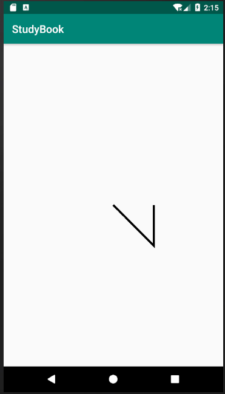

#### moveTo和 setLastPoint

方法预览：

```java
// moveTo
public void moveTo (float x, float y)

// setLastPoint
public void setLastPoint (float dx, float dy)
```

这两个方法在使用上如下不同：

| 方法名       | 简介                         | 是否影响之前的操作 | 是否影响之后操作 |
| ------------ | ---------------------------- | ------------------ | ---------------- |
| moveTo       | 移动下一次操作的起点位置     | 否                 | 是               |
| setLastPoint | 设置之前操作的最后一个点位置 | 是                 | 是               |

我们先使用moveTo :

```java
//移动坐标系值屏幕中心
canvas.translate(mWidth/2,mHeigth/2);
Path path=new Path();

//原点->（200,200）
path.lineTo(200,200);
//移动下一个操作的起点位置为 (200,100)
path.moveTo(200,100);
//(200,100)->(200,0)
path.lineTo(200,0);
//绘制
canvas.drawPath(path,paint);
```

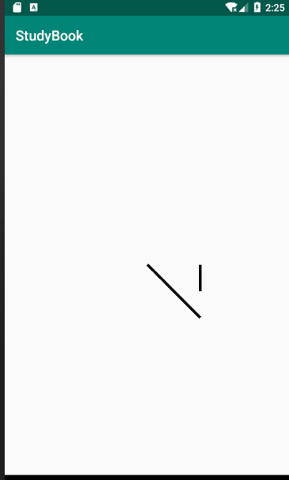

**接下来再看setLastPoint**

```JAVA
//原点->（200,200）,此时最新点为(200,200)
path.lineTo(200,200);
//更改上一个操作点的最终位置，也就是将(200,200)改为(400,400)
//同时也会影响上次绘制和之后的绘制起点
path.setLastPoint(400,400);
//(400,400)->(200,0)
path.lineTo(200,0);
//绘制
canvas.drawPath(path,paint);
```

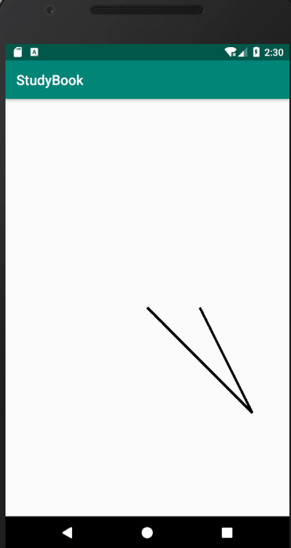


接下来我们看看混合使用：

```java
//移动坐标系值屏幕中心
canvas.translate(mWidth/2,mHeigth/2);
Path path=new Path();

//原点->（200,200）,此时最新点为(200,200)
path.lineTo(200,200);
//更改下一次起点为(100,0)，并不影响以前绘制
path.moveTo(100,0);

//更改上一个操作点的最终位置，也就是将(100,0)改为(400,400)
path.setLastPoint(400,400);
//(400,400)->(200,0)
path.lineTo(200,0);
//绘制
canvas.drawPath(path,paint);
```

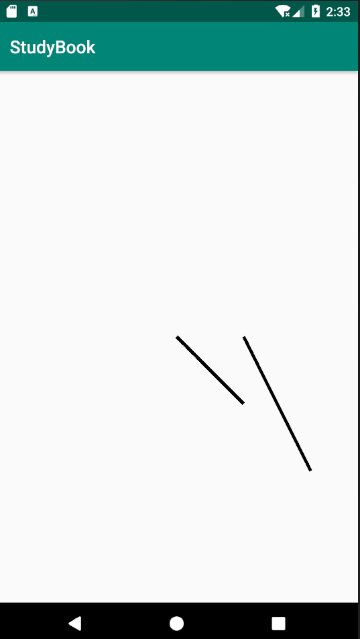

#### close

close方法用于连接当前最后一个点和最初一个点(如果两个点不重合的话)，最终会形成一个封闭图形。

```java
//移动坐标系值屏幕中心
canvas.translate(mWidth/2,mHeigth/2);
Path path=new Path();

//原点->（200,200）,此时最新点为(200,200)
path.lineTo(200,200);
//(200,200)->(200,0)
path.lineTo(200,0);
//连接最开始的点(即原点)与最后(200,0)，形成封闭图形
path.close();
canvas.drawPath(path,paint);
```

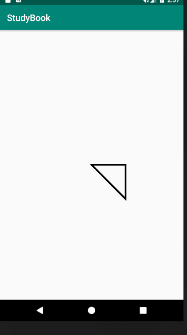


**注意：close 作用是封闭路径，与连接当前最后一个点和第一个点并不等价。如果连接了最后一个点和第一个点任然无法形成封闭图形，则close什么也不会做。**


### 2. addXxx与arcTo

主要用于在Path中添加基本图形，重点需要区分 addArc和 arcTo

#### 第一类（基本形状）

```java
// 第一类(基本形状)

// 圆形
public void addCircle (float x, float y, float radius, Path.Direction dir)
// 椭圆
public void addOval (RectF oval, Path.Direction dir)
// 矩形
public void addRect (float left, float top, float right, float bottom, Path.Direction dir)
public void addRect (RectF rect, Path.Direction dir)
// 圆角矩形
public void addRoundRect (RectF rect, float[] radii, Path.Direction dir)
public void addRoundRect (RectF rect, float rx, float ry, Path.Direction dir)
```

**这一类就是在path 中添加一个基本形状，基本形状部分和前面在 Canvas 中使用的差别并不是很大。**

不过，需要注意的是，在这些方法中，参数都带了 **Path.Direction** ，那这是什么呢？

Direction 的意思是方向，趋势。它是一个枚举类型，如下

```java
/**
 * Specifies how closed shapes (e.g. rects, ovals) are oriented when they
 * are added to a path.
 */
public enum Direction {
    /** clockwise */
    CW  (0),    // must match enum in SkPath.h
    /** counter-clockwise */
    CCW (1);    // must match enum in SkPath.h

    Direction(int ni) {
        nativeInt = ni;
    }
    final int nativeInt;
}
```

| 类型 | 解释              | 翻译   |
| ---- | ----------------- | ------ |
| CW   | clockwise         | 顺时针 |
| CCW  | counter-clockwise | 逆时针 |

**那它的作用到底是干啥的呢？**

| 序号 | 作用                                             |
| ---- | ------------------------------------------------ |
| 1    | 在添加图形时确定闭合顺序(各个点的记录顺序)       |
| 2    | 对图形的渲染结果有影响(是判断图形渲染的重要条件) |


好吧，懵逼了，我们接着从Demo往下看：

我们先看闭合顺序：

```java
//移动坐标系值屏幕中心
canvas.translate(mWidth/2,mHeigth/2);
Path path=new Path();

path.addRect(-200,-200,200,200,Path.Direction.CW);
//重置最后一个点的位置
path.setLastPoint(-200,100);
canvas.drawPath(path,paint);
```

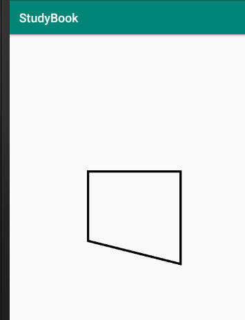


可以发现，图形发生了变化。为什么会这样呢？

> 我们绘制一个矩形(仅是边线)，实际上只需要4此 lineTo 操作即可，也就是说，只需要知道4个点的坐标，然后moveTo(移动)到第一个点，之后依次 lineTo(绘制，接着上个点位置) 就行。
>
> 但是为什么要这样做呢？我们一般在使用的时候确定一个矩形最少需要两个点(对角线的两个点)，然后根据两个点的坐标直接算出4条边然后画出来就行了，干嘛还需要计算出4个点的坐标，之后再连直线呢？
>
> 这个就要涉及一些path的存储问题了，前面在path中的定义中说过，Path是封装了由直线和曲线(二次，三次贝塞尔曲线)构成的几何路径。其中曲线部分用的是贝塞尔曲线，稍后再讲。 然而除了曲线部分就只剩下直线了，对于直线的存储最简单的就是记录坐标点，然后直接连接各个点就行了。虽然记录矩形只需要两个点，但是如果只用两个点来记录一个矩形的话，就要额外增加一个标志位来记录这是一个矩形，显然对于存储和解析都是很不划算的事情，将矩形转换为直线，为的就是存储记录方便。

回到我们的正题上，我们上面的的顺时针和逆时针的作用是什么呢？

简单来说就是记录图形中的点，分为顺时针记录和逆时针记录。CW指的是顺时针记录，CWW指逆时针记录。

用上面的demo举例子的话，我们刚才重置的是最后一个点，而如果将模式改为CWW，我们重置的相对于现在来说，就会是第一个点。也就是这个意思。

我们还是用Demo来看一下：

```java
canvas.translate(mWidth/2,mHeigth/2);
Path path=new Path();

path.addRect(-200,-200,200,200,Path.Direction.CCW);
//重置最后一个点的位置->相对于上一个demo，这个是第一个点
path.setLastPoint(-100,100);
canvas.drawPath(path,paint);
```

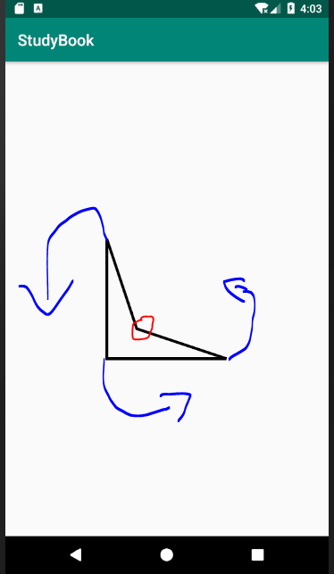


注意：我们参数中两个点的位置特别重要，不知道大家是否观察到，(-200,-200)点和（200,200）坐标确定了我们的矩形，其中起始点就是我们指定的第一个点坐标，无论是顺时针还时逆时针，所以在实际应用中，点的顺序很关键。一定记得确定。

我们还是交换一下两个点的坐标，再来看看：

```java
canvas.translate(mWidth/2,mHeigth/2);
Path path=new Path();

//这里换了坐标点顺序  --注意
path.addRect(200,200,-200,-200,Path.Direction.CCW);
//重置最后一个点的位置
path.setLastPoint(-100,100);
canvas.drawPath(path,paint);
```

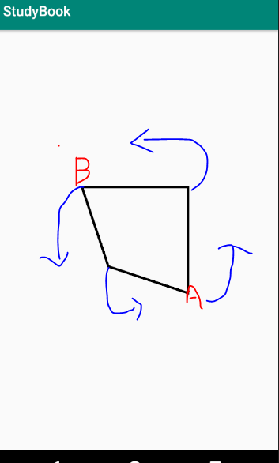


观察图就可以发现，A点为我们设定的起始点，我们点的位置顺序决定了图的样子。


#### 第二类（Path）

方法预览

```java
// 第二类(Path)
// path
public void addPath (Path src)
public void addPath (Path src, float dx, float dy)
public void addPath (Path src, Matrix matrix)
```

这个就是将两个Path合并称为一个。

第三个方法是将src添加到当前path之前先使用 Matrix 进行变换。

第二个方法时将src位移之后再添加到当前path里面。

```java
 //移动坐标系值屏幕中心
canvas.translate(mWidth / 2, mHeigth / 2);
//反转y轴
canvas.scale(1, -1);
Path path = new Path();

Path src = new Path();
path.addRect(-200, -200, 200, 200, Path.Direction.CW);
src.addCircle(0, 0, 100, Path.Direction.CW);
//移动位置再添加
path.addPath(src, 0, 200);
//绘制合并后的路径
canvas.drawPath(path, paint);
```

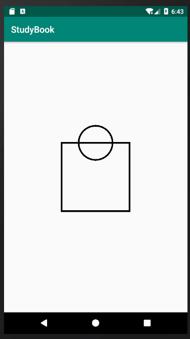


注意上面代码里有一句是反转y轴，否则y轴向下是增，圆就在下面了。

在上面的图里，我们将包含圆形的path添加到包含矩形的path之前将其移动了一端距离，最终的结果如上图所示。


#### 第三类（addArc与arcTo）

方法预览：

```java
// 第三类(addArc与arcTo)
// addArc
public void addArc (RectF oval, float startAngle, float sweepAngle)
public void addArc(float left, float top, float right, float bottom, float startAngle,
            float sweepAngle)
// arcTo
public void arcTo (RectF oval, float startAngle, float sweepAngle)
public void arcTo (RectF oval, float startAngle, float sweepAngle, boolean forceMoveTo)
```

参数表:

| 参数        | 摘要                              |
| ----------- | --------------------------------- |
| oval        | 圆弧的外切矩形。                  |
| startAngle  | 开始角度                          |
| sweepAngle  | 扫过角度(-360 <= sweepAngle <360) |
| forceMoveTo | 是否强制使用MoveTo                |

从名字就可以看出，这两个方法都是与圆弧有关的，作用都是添加一个圆弧到path中，两者的区别如下：

| 名称   | 作用               | 区别                                                         |
| ------ | ------------------ | ------------------------------------------------------------ |
| addArc | 添加一个圆弧到path | 直接添加一个圆弧到path中                                     |
| arcTo  | 添加一个圆弧到path | 添加一个圆弧到path，如果圆弧的起点和上次最后一个坐标点不相同，就连接两个点 |


**forMoveTo** 是什么作用呢？

这个变量的意思为 “是否强制使用 moveTo”，也就是说，是否使用 moveTo 将变量移动到圆弧起点位移。也就意味着：

| forceMoveTo | 含义                                                     | 等价方法                                                     |
| ----------- | -------------------------------------------------------- | ------------------------------------------------------------ |
| true        | 将最后一个点移动到圆弧起点，即不连接最后一个点与圆弧起点 | public void addArc (RectF oval, float startAngle, float sweepAngle) |
| false       | 不移动，而是连接最后一个点与圆弧起点                     | public void arcTo (RectF oval, float startAngle, float sweepAngle) |


**arcTo**示例

```java
  //移动坐标系值屏幕中心
        canvas.translate(mWidth / 2, mHeigth / 2);
        canvas.scale(1, -1);
        Path path=new Path();
        path.lineTo(100,100);
        RectF oval=new RectF(0,0,300,300);
        path.addArc(oval,0,250);
//        path.arcTo(oval,0,270,false); //和上面一句同价
        canvas.drawPath(path,paint);
```

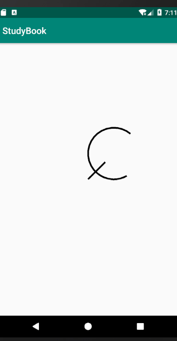


**示例（arcTo）**

```java
//移动坐标系值屏幕中心
canvas.translate(mWidth / 2, mHeigth / 2);
canvas.scale(1, -1);
Path path=new Path();
path.lineTo(100,100);
RectF oval=new RectF(0,0,300,300);
//添加圆弧，如果圆弧起点和最后坐标点不同就连接。
path.arcTo(oval,0,250);
canvas.drawPath(path,paint);
```

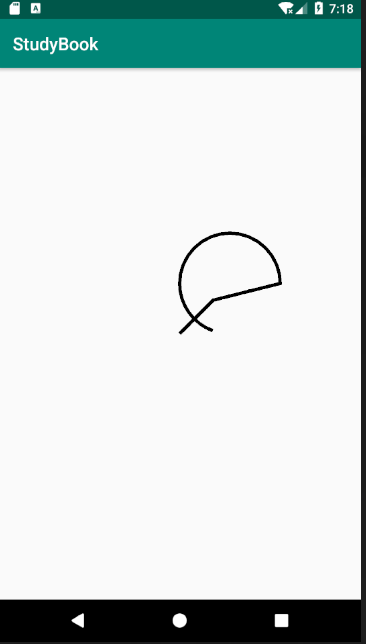


#### 3. isEmpty,isRect,isConvex,set，offset

#### isEmpty

方法预览：

```
public boolean isEmpty ()
```

判断path中是否包含内容。

```java
Path path = new Path();
Log.e("1",path.isEmpty()+"");

path.lineTo(100,100);
Log.e("2",path.isEmpty()+"");
```

log输出结果:

```java
com.sloop.canvas E/1: true
com.sloop.canvas E/2: false
```


##### isRect

判断path是否是一个矩形，如果是一个矩形，会将矩形的信息存放进参数rect中

```java
public boolean isRect (RectF rect)
```

```java
Path path = new Path();
path.lineTo(0, 0);
path.lineTo(100, 0);
path.lineTo(100,100);
path.lineTo(0,100);
RectF rectF=new RectF();
//如果是矩形，会将矩形信息存放进rectf中
path.isRect(rectF);
Toast.makeText(getContext(), "left:"+rectF.left+"--"+
        "top"+rectF.top+"---right"+rectF.right+"---"+"bottom"+rectF.bottom
        , Toast.LENGTH_SHORT).show();
```


##### set

将path的信息设置到新的path上

```java
public void set (Path src)
```

```java
Path path=new Path();
//添加一个圆，顺时针绘制
path.addCircle(300,300,100,Path.Direction.CW);
Path path1=new Path();
//添加到新的path中
path1.set(path);
canvas.drawPath(path1,paint);
```


##### offset

对path进行一端平移，他和Canvas中的translate作用很像，但Canvas作用于整个画布，而path的 offset制作用与当前path.

```java
public void offset (float dx, float dy)
public void offset (float dx, float dy, Path dst)
```

第二个方法中的 **Path** 是用于存储平移后的 path。

```java
 Path path=new Path();
 Path path1=new Path();
 //添加一个圆，顺时针绘制
 path.addCircle(300,300,100,Path.Direction.CW);

 //添加一个矩形
 path1.addRect(200,200,500,500,Path.Direction.CW);

 //因为添加了path1，所以平移不会作用于本身，path1会保存平移后的信息
 path.offset(300,0,path1);
 //绘制path，并不会平移，因为刚才平移时传入了path1
 canvas.drawPath(path,paint);
 paint.setColor(Color.RED);
 //此时绘制，因为刚才保存时，原数据被清，所以此时绘制的其实是刚才平移的圆
 canvas.drawPath(path1,paint);
```


从代码23里可以看出，虽然我们在path1中添加了一个矩形，但是并没有绘制出来，所以当path1中存在内容时，path1中原有的内容会被清空，从而存放平移后的path.


## 自定义雷达图-最佳实例Demo

**注明**：[原作者](https://blog.csdn.net/a394268045/article/details/71843493)

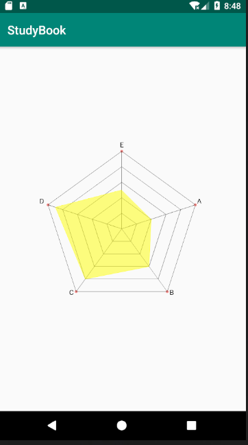


```java
/**
 * @author Petterp on 2019/6/27
 * Summary:自定义雷达图
 * 邮箱：1509492795@qq.com
 */
public class CanvasView extends View {
    private static final String TAG = "RadarView";
    private int count = 5;                //数据个数
    private float angle = (float) (Math.PI * 2 / count);
    private float radius;
    private float maxRadius;            //网格最大半径
    private int centerX;                  //中心X
    private int centerY;                  //中心Y
    private String[] titles = {"A", "B", "C", "D","E"};
    private double[] data = {40, 60, 80, 90,50}; //各维度分值
    private float maxValue = 100;             //数据最大值
    private Paint mainPaint;                //雷达区画笔
    private Paint valuePaint;               //数据区画笔
    private Paint textPaint;                //文本画笔
    private Paint pointPaint;               //圆点画笔

    public CanvasView(Context context, AttributeSet attrs, int defStyleAttr) {
        super(context, attrs, defStyleAttr);
        init();
    }

    public CanvasView(Context context, AttributeSet attrs) {
        super(context, attrs);
        init();
    }

    public CanvasView(Context context) {
        super(context);
        init();
    }


    //初始化
    private void init() {

        mainPaint = new Paint();
        mainPaint.setAntiAlias(true);
        mainPaint.setColor(Color.BLACK);
        mainPaint.setStyle(Paint.Style.STROKE);

        pointPaint = new Paint();
        pointPaint.setAntiAlias(true);
        pointPaint.setColor(Color.parseColor("#f38683"));
        pointPaint.setStyle(Paint.Style.FILL_AND_STROKE);

        valuePaint = new Paint();
        valuePaint.setAntiAlias(true);
        valuePaint.setColor(Color.YELLOW);
        valuePaint.setAlpha(50);
        valuePaint.setStyle(Paint.Style.FILL_AND_STROKE);

        textPaint = new Paint();
        textPaint.setTextSize(30);
        textPaint.setStyle(Paint.Style.FILL);
        textPaint.setColor(Color.BLACK);
    }

    @Override
    protected void onSizeChanged(int w, int h, int oldw, int oldh) {
        radius = Math.min(h, w) / 2 * 0.5f;
        maxRadius = radius / (count - 1) * count;
        centerX = w / 2;
        centerY = h / 2;
        postInvalidate();
        super.onSizeChanged(w, h, oldw, oldh);
    }


    @Override
    protected void onDraw(Canvas canvas) {
        drawPolygon(canvas);
        drawLines(canvas);
        drawText(canvas);
        drawRegion(canvas);
    }

    /*
     * 画中心原点
     */
    private void drawPoint(Canvas canvas, float x, float y) {

        //绘制小圆点
        canvas.drawCircle(x, y, 6, pointPaint);
    }

    /**
     * 绘制正多边形
     */
    private void drawPolygon(Canvas canvas) {
        Path path = new Path();
        float r = radius / (count - 1);
        for (int i = 1; i <= count; i++) {
            float curR = r * i;
            path.reset();
            for (int j = 1; j <= count; j++) {
                float x = (float) (centerX + curR * Math.sin(angle * j));
                float y = (float) (centerY - curR * Math.cos(angle * j));
                if (j == 1) {
                    path.moveTo(x, y);
                } else {

                    path.lineTo(x, y);
                }
                if (i == count) {
                    drawPoint(canvas, x, y);
                }
            }
            path.close();
            canvas.drawPath(path, mainPaint);
        }
    }

    /**
     * 绘制直线
     */
    private void drawLines(Canvas canvas) {
        Path path = new Path();
        for (int i = 1; i <= count; i++) {
            path.reset();
            path.moveTo(centerX, centerY);
            float x = (float) (centerX + maxRadius * Math.sin(angle * i));
            float y = (float) (centerY - maxRadius * Math.cos(angle * i));
            path.lineTo(x, y);
            canvas.drawPath(path, mainPaint);
        }
    }

    /**
     * 绘制文字
     * 其实四个象限，是以(centerX, centerY)为圆点的象限
     *
     * @param canvas
     */
    private void drawText(Canvas canvas) {
        Paint.FontMetrics fontMetrics = textPaint.getFontMetrics();
        float fontHeight = fontMetrics.descent - fontMetrics.ascent;
        for (int i = 1; i <= count; i++) {
            float x = (float) (centerX + (maxRadius + fontHeight / 2) * Math.sin(angle * i));
            float y = (float) (centerY - (maxRadius + fontHeight / 2) * Math.cos(angle * i));

            float relateX = x - centerX;
            float relateY = y - centerY;

            float dis = textPaint.measureText(titles[i - 1]);//文本长度
            if (relateX >= 0 && relateY >= 0) {//第4象限

                canvas.drawText(titles[i - 1], x , y, textPaint);
            } else if (relateX < 0 && relateY >= 0) {//第3象限


                canvas.drawText(titles[i - 1], x - dis, y, textPaint);
            } else if (relateX < 0 && relateY < 0) {//第2象限

                canvas.drawText(titles[i - 1], x - dis, y, textPaint);
            } else if (relateX >= 0 && relateY < 0) {//第1象限

                canvas.drawText(titles[i - 1], x - dis / 2, y, textPaint);
            }
        }
    }

    /**
     * 绘制中间有效区域
     *
     * @param canvas
     */
    private void drawRegion(Canvas canvas) {
        Path path = new Path();
        valuePaint.setAlpha(255);
        for (int i = 1; i <= count; i++) {
            double percent = data[i - 1] / maxValue;
            float x = (float) (centerX + maxRadius * Math.sin(angle * i) * percent);
            float y = (float) (centerY - maxRadius * Math.cos(angle * i) * percent);

            if (i == 1) {
                path.moveTo(x, y);
            } else {
                path.lineTo(x, y);
            }
        }
        valuePaint.setStyle(Paint.Style.STROKE);
        canvas.drawPath(path, valuePaint);
        valuePaint.setAlpha(127);
        //绘制填充区域
        valuePaint.setStyle(Paint.Style.FILL_AND_STROKE);
        canvas.drawPath(path, valuePaint);
    }

    //设置标题
    public void setTitles(String[] titles) {
        this.titles = titles;
    }

    //设置数值
    public void setData(double[] data) {
        this.data = data;
    }


    public float getMaxValue() {
        return maxValue;
    }

    //设置最大数值
    public void setMaxValue(float maxValue) {
        this.maxValue = maxValue;
    }

    //设置蜘蛛网颜色
    public void setMainPaintColor(int color) {
        mainPaint.setColor(color);
    }

    //设置标题颜色
    public void setTextPaintColor(int color) {
        textPaint.setColor(color);
    }

    //设置覆盖局域颜色
    public void setValuePaintColor(int color) {
        valuePaint.setColor(color);
    }
}
```