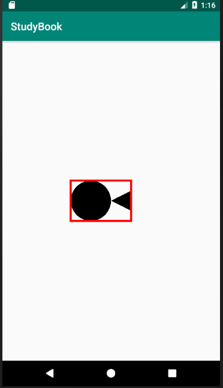

# 8.Path完结篇

## Path常用方法表

| 作用            | 相关方法                                                     | 备注                                                         |
| --------------- | ------------------------------------------------------------ | ------------------------------------------------------------ |
| 移动起点        | moveTo                                                       | 移动下一次操作的起点位置                                     |
| 设置终点        | setLastPoint                                                 | 重置当前path中最后一个点位置，如果在绘制之前调用，效果和moveTo相同 |
| 连接直线        | lineTo                                                       | 添加上一个点到当前点之间的直线到Path                         |
| 闭合路径        | close                                                        | 连接第一个点连接到最后一个点，形成一个闭合区域               |
| 添加内容        | addRect, addRoundRect, addOval, addCircle, addPath, addArc, arcTo | 添加(矩形， 圆角矩形， 椭圆， 圆， 路径， 圆弧) 到当前Path (注意addArc和arcTo的区别) |
| 是否为空        | isEmpty                                                      | 判断Path是否为空                                             |
| 是否为矩形      | isRect                                                       | 判断path是否是一个矩形                                       |
| 替换路径        | set                                                          | 用新的路径替换到当前路径所有内容                             |
| 偏移路径        | offset                                                       | 对当前路径之前的操作进行偏移(不会影响之后的操作)             |
| 贝塞尔曲线      | quadTo, cubicTo                                              | 分别为二次和三次贝塞尔曲线的方法                             |
| rXxx方法        | rMoveTo, rLineTo, rQuadTo, rCubicTo                          | **不带r的方法是基于原点的坐标系(偏移量)， rXxx方法是基于当前点坐标系(偏移量)** |
| 填充模式        | setFillType, getFillType, isInverseFillType, toggleInverseFillType | 设置,获取,判断和切换填充模式                                 |
| 提示方法        | incReserve                                                   | 提示Path还有多少个点等待加入**(这个方法貌似会让Path优化存储结构)** |
| 布尔操作(API19) | op                                                           | 对两个Path进行布尔运算(即取交集、并集等操作)                 |
| 计算边界        | computeBounds                                                | 计算Path的边界                                               |
| 重置路径        | reset, rewind                                                | 清除Path中的内容 **reset不保留内部数据结构，但会保留FillType.** **rewind会保留内部的数据结构，但不保留FillType** |
| 矩阵操作        | transform                                                    | 矩阵变换                                                     |


## Path方法详解

rXXX方法

> rXXX方法的坐标使用的是相对位置(基于当前点的位移)，而之前方法得坐标是绝对位置(基于当前坐标系的坐标)

```java
Path path=new Path();
//移动起始点坐标
path.moveTo(100,100);
//以起点为基础的坐标画线->即相对坐标
//简单理解可为  (100,100)->(200,300)
path.rLineTo(100,200);
canvas.drawPath(path,paint);
```


### 填充模式

我们知道，Paint有三种样式，"描边","填充",“描边加填充”，我们这要了解的就是当Paint设置为后两种样式是**不同的填充模式对图形渲染效果的影响**。

我们要给一个图形内部填充颜色，首先要分清那一部分是外部，那一部分是内部。

机器判断图形内外，一般有以下两种方法。

| 方法           | 判定条件                                  | 解释                                                         |
| -------------- | ----------------------------------------- | ------------------------------------------------------------ |
| 奇偶规则       | 奇数表示在图形内，偶数表示在图形外        | **从任意一点射出一条线，与图形的交线是奇数，则认为这个点在图形内部，需要绘制颜色；反之如果是偶数，则认为这个点在图形外部，不需要绘制颜色。** |
| 非零环绕数规则 | 若环绕数为0表示在图形外，非零表示在图形内 | 首先使图形的边变为矢量。将环绕数初始化为零。再从任意位置p作一条射线。当从p点沿射线方向移动时，对在每个方向上穿过射线的边计数，每当图形的边从右到左穿过射线时，环绕数加1，从左到右时，环绕数减1。处理完图形的所有相关边之后，若环绕数为非零，则p为内部点，否则，p是外部点。 |

我们接着来看看这两种方法时如何来工作的吧。

#### 奇偶规则(Event-Odd Rule)


如上图Demo,在上图中有一个四边形，我们选取了三个点来判断这些点是否在图形内部。

1. P1： 从P1发出一条射线，发现图形与该射线相交边数为0，偶数，故P1 点在图形内部。
2. P2：从P2发出一条射线，发现图形与该射线相交边数为1，奇数，故P2点在图形内部。
3. P3：从P3发出一条射线，发现图形与该射线相交边数为2，偶数，故P3点在图形外部。


#### 非零环绕数规则(Non-Zero Winding Number Rule)

我们知道，在给Path中添加图形时需要指定图形的添加方式，使用顺时针还时逆时针，另外我们不论是使用lineTo,quadTo,cubicTo还时其他连接线的方法，都是从一个点连接到另一个点。也就是说，**Path中任何线段都是有方向性的**。这也是使用非零环绕数规则的基础。

我们用一个Demo来演示这个效果：


### 自相交图形

**自相交图形定义：多边形在平面内除顶点外还有其他公共点。**


#### Android中的填充模式

Android中的填充模式有4中，是封装在 Path的一个枚举类。

| 模式             | 简介             |
| ---------------- | ---------------- |
| EVEN_ODD         | 奇偶规则         |
| INVERSE_EVEN_ODD | 反奇偶规则       |
| WINDING          | 非零环绕数规则   |
| INVERSE_WINDING  | 反非零环绕数规则 |

上面有4中模式，分成两队，例如“奇偶规则” 与 ”反奇偶规则“ 是一对，它们之间又有什么关系呢？

Inverse和含义是"相反，对立"，说明反奇偶规则刚好和奇偶规则相反，例如对于一个矩形而言，使用奇偶规则会填充矩形内部，而是用反奇偶规则会填充矩形外部。

估计听起来都很懵，我们会在最后的代码里用实例来进行演示。


#### Android与填充模式相关的方法

| 方法                  | 作用                                           |
| --------------------- | ---------------------------------------------- |
| setFillType           | 设置填充规则                                   |
| getFillType           | 获取当前填充规则                               |
| isInverseFillType     | 判断是否是反向(INVERSE)规则                    |
| toggleInverseFillType | 切换填充规则(即原有规则与反向规则之间相互切换) |

实例Demo

##### 非零环绕数规则： ->WINDING

```java
//设置画笔为填充
paint.setColor(Color.GREEN);
paint.setStyle(Paint.Style.FILL);
canvas.translate(mWidth,mHight);
//移动画布为中心
Path path=new Path();
//Path默认使用WINDING绘制
path.addCircle(0, 0, 200, Path.Direction.CW);
path.addCircle(200, 0, 200, Path.Direction.CW);
canvas.drawPath(path, paint);
```


看不出什么吧，我们接着改一个地方继续

```java
//设置画笔为填充
paint.setColor(Color.GREEN);
paint.setStyle(Paint.Style.FILL);
canvas.translate(mWidth,mHight);
//移动画布为中心
Path path=new Path();
//Path默认使用WINDING绘制
path.addCircle(0, 0, 200, Path.Direction.CW);
path.addCircle(200, 0, 200, Path.Direction.CCW);
canvas.drawPath(path, paint);
```


我们更改了第二个圆的绘制方向，变化却很明显。

所以从这个我们就可以得出：**非零环绕原则**，**从任意一点发射一条线，默认值是0，遇到顺时针交点则+1，遇到逆时针交点则-1，最终如果不等于0，则认为这个点是图形内部的点，则需要绘制颜色；反之，如果这个值是0，则认为这个点不在图形内部，则不需要绘制颜色。**


#### 反非零环绕数规则 -> INVERSE_WINDING

inverse表示反转的意思，相同的代码，绘制出来的结果是相反的，如下：

```java
//设置画笔为填充
paint.setColor(Color.GREEN);
paint.setStyle(Paint.Style.FILL);
canvas.translate(mWidth,mHight);
//移动画布为中心
Path path=new Path();
//更改填充模式为非零环绕原则
path.setFillType(Path.FillType.INVERSE_WINDING);
path.addCircle(0, 0, 200, Path.Direction.CW);
path.addCircle(200, 0, 200, Path.Direction.CW);
canvas.drawPath(path, paint);
```


结合我们最上面Demo,效果明显便知：


#### 奇偶规则：-> EVEN_ODD:

**我们接着来看奇偶规则**：

```java
//设置画笔为填充
paint.setColor(Color.GREEN);
paint.setStyle(Paint.Style.FILL);
canvas.translate(mWidth,mHight);
//移动画布为中心
Path path=new Path();
//更改填充模式为奇偶规则
path.setFillType(Path.FillType.EVEN_ODD);
path.addCircle(0, 0, 200, Path.Direction.CW);
path.addCircle(200, 0, 200, Path.Direction.CW);
canvas.drawPath(path, paint);
```


和上面那个没啥区别啊？好像一样。

EVEN的意思是偶数，ODD是奇数的意思。所以这个原则也被称为 **奇偶原则**。**从任意一点射出一条线，与图形的交线是奇数，则认为这个点在图形内部，需要绘制颜色；反之如果是偶数，则认为这个点在图形外部，不需要绘制颜色。**


#### 反奇偶规则：-> INVERSE_EVEN_ODD

继续改一下代码：

```java
//设置画笔为填充
paint.setColor(Color.GREEN);
paint.setStyle(Paint.Style.FILL);
canvas.translate(mWidth,mHight);
//移动画布为中心
Path path=new Path();
//更改填充模式为反奇偶规则
path.setFillType(Path.FillType.INVERSE_EVEN_ODD);
path.addCircle(0, 0, 200, Path.Direction.CW);
path.addCircle(200, 0, 200, Path.Direction.CW);
canvas.drawPath(path, paint);
```


效果一看便知。


### 布尔操作

布尔操作和我们所学的集合操作很像，所以需要一些交集，并集，差集等操作。

**布尔操作时两个Path 之间的运算，主要作用是用一些简单的图形通过一些规则合成一些相对比较复杂，或难以直接得到的图形**；

如太极中的阴阳鱼，如果用贝塞尔曲线制作的话，可能需要六段贝塞尔曲线才行，而在这里我们可以用四个Path通过布尔运算得到，而且会相对来说更容易理解一点。

```java
//设置画笔为填充
Path path1=new Path();
Path path2=new Path();
Path path3=new Path();
Path path4=new Path();

path1.addCircle(0,0,200,Path.Direction.CW);
path2.addRect(0,-200,200,200,Path.Direction.CW);
path3.addCircle(0,-100,100,Path.Direction.CW);
path4.addCircle(0,100,100,Path.Direction.CCW);
path1.op(path2,Path.Op.DIFFERENCE);
path1.op(path3,Path.Op.UNION);
path1.op(path4,Path.Op.DIFFERENCE);
canvas.drawPath(path1,paint);
```


讲真的，第一眼看过代码，我是懵逼的，这丫的是什么玩意。。。


我们接着来看解析：

Path的布尔运算有五种逻辑，如下:

| 逻辑名称           | 类比 | 说明                                   | 示意图                                                       |
| ------------------ | ---- | -------------------------------------- | ------------------------------------------------------------ |
| DIFFERENCE         | 差集 | Path1中减去Path2后剩下的部分           |  |
| REVERSE_DIFFERENCE | 差集 | Path2中减去Path1后剩下的部分           |  |
| INTERSECT          | 交集 | Path1与Path2相交的部分                 |  |
| UNION              | 并集 | 包含全部Path1和Path2                   |  |
| XOR                | 异或 | 包含Path1与Path2但不包括两者相交的部分 |  |

根据上面的方法解析，我们再看看是个什么样子：

****

4种颜色代表4个不同的path.

```java
path1.addCircle(0,0,200,Path.Direction.CW);		//红色大圆
path2.addRect(0,-200,200,200,Path.Direction.CW);		//橙黄色的矩形
path3.addCircle(0,-100,100,Path.Direction.CW);			//黄色小圆
path4.addCircle(0,100,100,Path.Direction.CCW);			//绿色小圆
```

相信看到这里，再对照上面的方法，很多人都应该看懂其中的原因了吧？

没看懂也没事，我再添几笔你看看


现在呢，是不是有一种，哇擦，原来如此啊。其实遇到这种问题，我们只要多画一下，相应的逻辑自然也就能理通了。


**好了，我们接着来看那些比较枯燥的方法：**

#### 布尔运算方法

在Path中的布尔运算有两个方法

```
boolean op (Path path, Path.Op op)
boolean op (Path path1, Path path2, Path.Op op)
```

这两个方法的返回值用于判断布尔运算符是否成功，它们的使用方法如下：

```java
// 对 path1 和 path2 执行布尔运算，运算方式由第二个参数指定，运算结果存入到path1中。
path1.op(path2, Path.Op.DIFFERENCE);

// 对 path1 和 path2 执行布尔运算，运算方式由第三个参数指定，运算结果存入到path3中。
path3.op(path1, path2, Path.Op.DIFFERENCE)
```


```java
//设置画笔为填充
int x=80;
int r=100;
canvas.translate(250,0);
Path path1=new Path();
Path path2=new Path();
Path pathOpResult=new Path();

path1.addCircle(-x,0,r,Path.Direction.CW);
path2.addCircle(x,0,r,Path.Direction.CW);
//交集，path1-path2
pathOpResult.op(path1,path2,Path.Op.DIFFERENCE);
canvas.translate(0,200);
canvas.drawText("DIFFERENCE",240,0,paint);
canvas.drawPath(pathOpResult,paint);

//差集 path2-path1后剩下的
pathOpResult.op(path1,path2,Path.Op.REVERSE_DIFFERENCE);
canvas.translate(0,300);
canvas.drawText("REVERSE_DIFFERENCE",240,0,paint);
canvas.drawPath(pathOpResult,paint);

//交集，path1和path2相交的部分
pathOpResult.op(path1,path2,Path.Op.INTERSECT);
canvas.translate(0,400);
canvas.drawText("INTERSECT",240,0,paint);
canvas.drawPath(pathOpResult,paint);

//并集，path1和path2相并的部分
pathOpResult.op(path1,path2,Path.Op.UNION);
canvas.translate(0,500);
canvas.drawText("UNION",240,0,paint);
canvas.drawPath(pathOpResult,paint);

//异或，path1和path2不包括相交的部分
pathOpResult.op(path1,path2,Path.Op.XOR);
canvas.translate(0,600);
canvas.drawText("XOR",240,0,paint);
canvas.drawPath(pathOpResult,paint);
```


#### 计算边界

这个方法主要作用是计算Path所占用的空间以及所在位置：方法如下

```java
void computeBounds(Rect bunds,boolead exact);
```

| 参数   | 作用                                                       |
| ------ | ---------------------------------------------------------- |
| bounds | 测量结果会放入这个矩形                                     |
| exact  | 是否精确测量，目前这一个参数作用已经废弃，一般写true即可。 |

```java
canvas.translate(mWidth,mHight);

//存放测量结果的矩形
RectF rectF=new RectF();
Path path=new Path();
path.lineTo(100,-50);
path.lineTo(100,50);
path.close();

path.addCircle(-100,0,100,Path.Direction.CW);

//测量Path
path.computeBounds(rectF,true);
canvas.drawPath(path,paint);
paint.setStyle(Paint.Style.STROKE);
paint.setColor(Color.RED);
canvas.drawRect(rectF,paint);
```




#### 重置路径

重置路径有两个办法，分别是reset 和 rewind.

| 方法   | 是否保留FillType设置 | 是否保留原有数据结构 |
| ------ | :------------------: | :------------------: |
| reset  |          是          |          否          |
| rewind |          否          |          是          |

**那这两个方法究竟什么时候用呢**？

选择权重: FillType > 数据结构

*因为“FillType”影响的是显示效果，而“数据结构”影响的是重建速度。*

