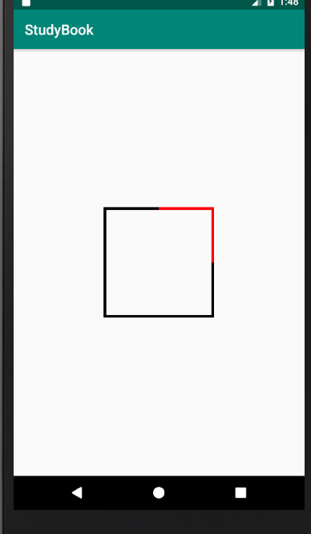
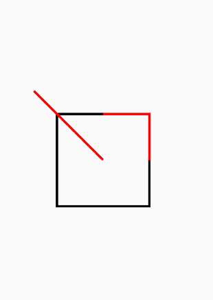
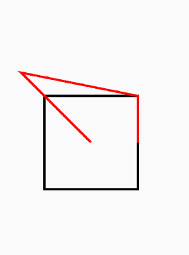
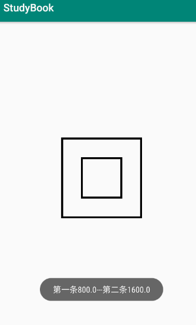
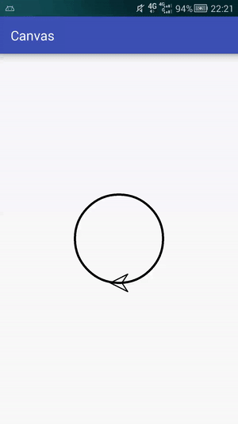
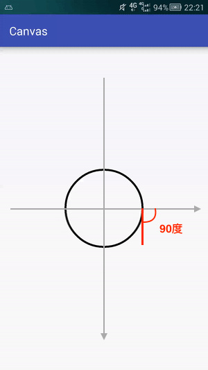
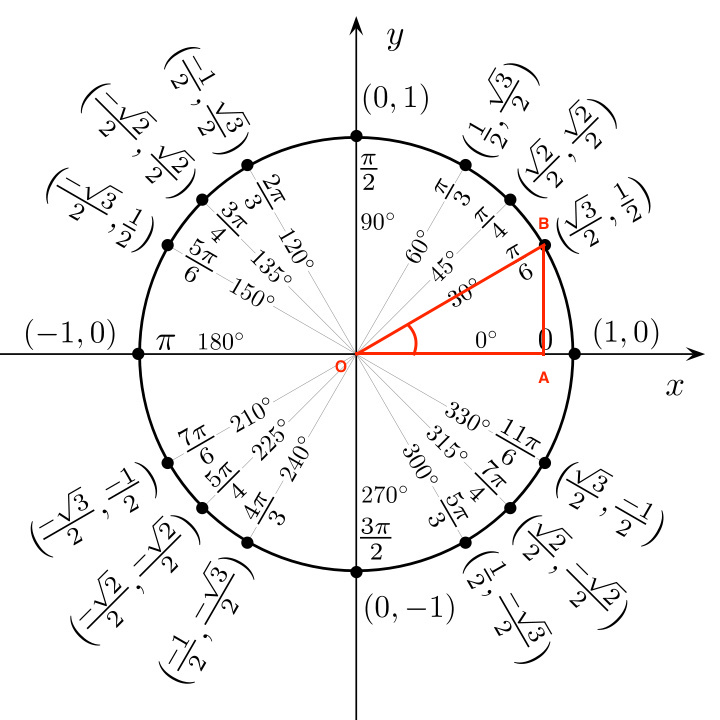

9.PathMeasure


## Path&PathMeasure

> **注明:  非常感谢 [gcssloop](www.gcssloop.com) 的博客，以下为我学习时的笔记记录。**

**更多Android学习笔记，请关注 *[Android-NoteBook](https://github.com/Petterpx/Android_NoteBook)*,欢迎Star。**


顾名思义，PathMeasure是一个用来测量 Path的类，主要方法如下：

## 构造方法

| 方法名                                      | 释义                                                         |
| ------------------------------------------- | ------------------------------------------------------------ |
| PathMeasure()                               | 创建一个空的PathMeasure                                      |
| PathMeasure(Path path, boolean forceClosed) | 创建 PathMeasure 并关联一个指定的Path(Path需要已经创建完成)。 |

公告方法

| 返回值  | 方法名                                                       | 释义                               |
| ------- | ------------------------------------------------------------ | ---------------------------------- |
| void    | setPath(Path path, boolean forceClosed)                      | 关联一个Path                       |
| boolean | isClosed()                                                   | 是否闭合                           |
| float   | getLength()                                                  | 获取Path的长度                     |
| boolean | nextContour()                                                | 跳转到下一个轮廓                   |
| boolean | getSegment(float startD, float stopD, Path dst, boolean startWithMoveTo) | 截取片段                           |
| boolean | getPosTan(float distance, float[] pos, float[] tan)          | 获取指定长度的位置坐标及该点切线值 |
| boolean | getMatrix(float distance, Matrix matrix, int flags)          | 获取指定长度的位置坐标及该点Matrix |

**PathMeasure的方法并不是很多，接下来我们就逐一讲解。**


---

### 构造函数

分为有参和无参 

#### 无参

```java
PathMeasure()
```

> 用这个构造函数可创建一个 空的 PathMeasure，但是如果使用之前需要先调用 setPath方法来与 Path进行关联。被关联的Path必须是已经创建好的，如果关联之后Path内容进行了更改，则需要使用 setPath方法 重新关联。

#### 有参

```java
 PathMeasure (Path path, boolean forceClosed)
```

> 用这个函数可创建一个空的PathMeasure ，但是使用之前需要先调用 setPath方法来与Path进行关联。被关联的Path必须是已经创建好的，如果关联之后Path内容进行了更改，则需要 setPath 方法重新关联。
>
> 该方法有两个参数，第一个参数是 被关联的Path，第二个参数是用来确保Path闭合，如果设置为true,则不论之前Path是否闭合，都会自动闭合该Path(如果Path可以闭合的话)。

> **注意**：
>
> 1. ***不论focreClosed 设置为何种状态(true或false),都不会影响原有Path的状态，即Path 与PathMeasure 关联之后，之前的 Path 不会有任何改变。***
> 2. ***foreClosed 的设置状态可能会影响测量结果，如果  Path 未闭合但在 与 PathMeasure 关联的时候设置 forceClosed 为true 时，测量结果可能会比Path实际长度稍长一点，获取到是该 Path闭合时的状态。*******

Demo

```java
canvas.translate(mWidth,mHight);

Path path=new Path();
path.lineTo(0,200);
path.lineTo(200,200);
path.lineTo(200,0);

PathMeasure measure1=new PathMeasure(path,false);
PathMeasure measure2=new PathMeasure(path,true);
Toast.makeText(getContext(), measure1.getLength()+"---"+measure2.getLength(), Toast.LENGTH_SHORT).show();
canvas.drawPath(path,paint);
```


我们在上面的Dmeo所创建的Path实际上是一个边长为 200的正方形的三条边，通过Toast我们就可以验证上面的总结。

> 1. 我们将Path 与两个的PathMeasure进行关联，并给 forceColsed 设置了不同的状态，之后绘制再绘制出来的Path没有任何变化，所以 Path 与 PathMeasure 进行关联并不会影响 Path 状态。
> 2. 我们可以看到，设置 forceClosed 为 true 的方法比设置 为 fase的 方法测量出来的长度要长一点，这是由于Path没有闭合的缘故，多出来的距离正是 Path最后一个点与最开始一个点之间点的距离。**forceColsed 为fase 测量的是当前Path状态的长度，forceClosed 为true,则不论Path 是否闭合测量的都是 Path 的闭合长度。**

## 相应方法

setPath，isClosed 和 getLength

> 这三个方法都如字面意思一样，非常简单，这里就简单叙述一下，不再过多讲解。
>
> setPath 是PathMeasure 与 Path **关联**的重要方法，效果和 构造函数 中两个参数的作用是一样的。
>
> **isClosed 用于判断Path 是否闭合**，但是如果你再关联 Path 的时候设置 forceColosed 为true的话，这个方法的返回值一定为true。
>
> getLength 用于获取 Path 的总长度。

### getSegment

getSegment用于获取Path的一个片段。

```java
   public boolean getSegment(float startD, float stopD, Path dst, boolean startWithMoveTo) {
        // Skia used to enforce this as part of it's API, but has since relaxed that restriction
        // so to maintain consistency in our API we enforce the preconditions here.
        }
```

相应的参数含义：

| 参数            | 作用                             | 备注                                                         |
| --------------- | -------------------------------- | ------------------------------------------------------------ |
| 返回值(boolean) | 判断截取是否成功                 | true 表示截取成功，结果存入dst中，false 截取失败，不会改变dst中内容 |
| startD          | 开始截取位置距离 Path 起点的长度 | 取值范围: 0 <= startD < stopD <= Path总长度                  |
| stopD           | 结束截取位置距离 Path 起点的长度 | 取值范围: 0 <= startD < stopD <= Path总长度                  |
| dst             | 截取的 Path 将会添加到 dst 中    | 注意: 是添加，而不是替换                                     |
| startWithMoveTo | 起始点是否使用 moveTo            | 用于保证截取的 Path 第一个点位置不变                         |

> 如果 startD，stopD 的数值不在取值范围[0,getLength] 内，或者 startD == stopD 则返回值为 false,不会改变 dst内容。

我们用一个Demo来演示这个方法的使用过程：

```java
Path path=new Path();
//创建Path并添加了一个矩形
path.addRect(-200,-200,200,200,Path.Direction.CW);
canvas.drawPath(path,paint);
//创建用于存储截取后内容的 Path
Path dst=new Path();
//将Path与 PathMeasure关联，此时已经测量了path的边缘长度
PathMeasure measure=new PathMeasure(path,false);

//截取一部分存入dst中，并使用 moveTo 保持截取得到的 Path 第一个点的位置不变
measure.getSegment(200,600,dst,true);
paint.setColor(Color.RED);
//绘制dst
canvas.drawPath(dst,paint);
```



上图中的红色小块就是我们截取的图形。

> PathMeasure measure=new PathMeasure(path,false);之后，已经将长度获取到了，然后moveTo使用起始点位置，开始 startD->200，也就是距离起始点200，stopD->600,距离起始点600.在上面已经用红色标记了。

但是当dst 中有内容时会怎样呢？

```java
Path path=new Path();
//创建Path并添加了一个矩形
path.addRect(-200,-200,200,200,Path.Direction.CW);
canvas.drawPath(path,paint);

Path dst=new Path();
dst.lineTo(-300,-300);

//创建用于存储截取后内容的 Path
//将Path与 PathMeasure关联
PathMeasure measure=new PathMeasure(path,false);
//截取一部分存入dst中，并使用 moveTo 保持截取得到的 Path 第一个点的位置不变
measure.getSegment(200,600,dst,true);
paint.setColor(Color.RED);
//绘制dst
canvas.drawPath(dst,paint);
```



可以发现，我们Path里面的线还在。并没有被替换，而且因为使用了 moveTo(方法里面true)，所以第一个点位置并没有变。


现在我们将 startWithMoveTo  改为false,看看效果会怎样

```java
Path path=new Path();
//创建Path并添加了一个矩形
path.addRect(-200,-200,200,200,Path.Direction.CW);
canvas.drawPath(path,paint);

Path dst=new Path();
dst.lineTo(-300,-300);

//创建用于存储截取后内容的 Path
//将Path与 PathMeasure关联
PathMeasure measure=new PathMeasure(path,false);
//截取一部分存入dst中，起始点不使用 moveTo
measure.getSegment(200,600,dst,false);
paint.setColor(Color.RED);
//绘制dst
canvas.drawPath(dst,paint);
```




从上面我们可以得知：**如果startWithMoveTo 为 true,则被截取出来到Path 片段保持原状，如果 startWithmoveTo 为false ，则会将截取出来的 Path片段的起始点移动到dst的最后一个点，以保证 dst的连续性。**

所以，也可以用下面的规则来判断 startWithMoveTo的取值：

| 取值  | 主要功用                              |
| ----- | ------------------------------------- |
| true  | 保证截取得到的 Path 片段不会发生形变  |
| false | 保证存储截取片段的 Path(dst) 的连续性 |


### nextContour

我们知道Path 可以由多条曲线构成，但不论是 getLength,getSegment 或者是其他方法，都只会在其中第一条线段上运行，而这个 **nextContour** 就是用于跳转到下一条曲线到方法，如果跳转成功，则返回true，如果跳转失败，则返回 false.

我们用下面这个Demo来演示一下效果：

```java
Path path=new Path();
//添加小矩形
path.addRect(-100,-100,100,100,Path.Direction.CW);
//添加大矩形
path.addRect(-200,-200,200,200,Path.Direction.CW);
//绘制Path
canvas.drawPath(path,paint);
//Path与 PathMeasure 关联
PathMeasure measure=new PathMeasure(path,false);
//获取第一条路径的长度
float len1=measure.getLength();
//跳转到下一条路径
measure.nextContour();
//获得第二条路径的长度
float len2=measure.getLength();
Toast.makeText(getContext(), "第一条"+len1+"---第二条"+len2, Toast.LENGTH_SHORT).show();
```



我们观察结果，可以发现：

1. 曲线的顺序和 Path 中添加的顺序有关。
2. getLength 获取到是当前一条曲线分长度，而不是整个Path 的长度。
3. getLength 等方法是针对当前的曲线。


### getPosTan

这个方法是用于得到路径上某一长度的位置以及该位置的正切值：

```java
boolean getPosTan(float distance,float[] pos,float[] tan)
```

方法各个参数解释

| 参数            | 作用                 | 备注                                                         |
| --------------- | -------------------- | ------------------------------------------------------------ |
| 返回值(boolean) | 判断获取是否成功     | true表示成功，数据会存入 pos 和 tan 中， false 表示失败，pos 和 tan 不会改变 |
| distance        | 距离 Path 起点的长度 | 取值范围: 0 <= distance <= getLength                         |
| pos             | 该点的坐标值         | 当前点在画布上的位置，有两个数值，分别为x，y坐标。           |
| tan             | 该点的正切值         | 当前点在曲线上的方向，使用 Math.atan2(tan[1], tan[0]) 获取到正切角的弧度值。 |

这个方法也不难理解，除了其中的 tan,这是干啥的呢？

**tan** 是用来判断Path 上趋势的，即在这个位置上曲线的走向。

我们以下面这个Demo来看：

#### 箭头图片


#### 效果图：



```java
public class CanvasView extends View {
    
    //用于记录当前的位置，取值范围[0,1]映射Path的整个长度
    private float currentValue = 0;
    //当前点的实际位置
    private float[] pos;
    //当前点的tangent值，用于计算图片所需旋转的角度
    private float[] tan;
    //箭头图片
    private Bitmap mBitmap;
    //矩阵，用于对图片进行一些操作
    private Matrix matrix;

    private int mWidth;
    private int mHight;
    private Paint paint;

    public CanvasView(Context context) {
        super(context);
    }

    public CanvasView(Context context, AttributeSet attrs) {
        super(context, attrs);
        paint = new Paint();
        paint.setTextSize(25f);
        paint.setStrokeWidth(10f);
        paint.setStyle(Paint.Style.STROKE);
        init(context);
    }

    @Override
    protected void onSizeChanged(int w, int h, int oldw, int oldh) {
        super.onSizeChanged(w, h, oldw, oldh);
        mWidth = w / 2;
        mHight = h / 2;
    }

    @RequiresApi(api = Build.VERSION_CODES.KITKAT)
    @Override
    protected void onDraw(Canvas canvas) {
        super.onDraw(canvas);
        canvas.translate(mWidth, mHight);
        //创建Path
        Path path=new Path();
        path.addCircle(0,0,200,Path.Direction.CW);
        PathMeasure measure=new PathMeasure(path,false);

        currentValue+=0.005;
        if (currentValue>=1){
            currentValue=0;
        }
        measure.getPosTan(measure.getLength()*currentValue,pos,tan);
        matrix.reset();
        //计算图片旋转角度
        float degrees= (float) (Math.atan2(tan[1],tan[0])*180/Math.PI);
        matrix.postRotate(degrees,mBitmap.getWidth()/2,mBitmap.getHeight()/2);
        matrix.postTranslate(pos[0]-mBitmap.getWidth()/2,pos[1]-mBitmap.getHeight()/2);

        canvas.drawPath(path,paint);
        canvas.drawBitmap(mBitmap,matrix,paint);
        invalidate();
    }
    private void init(Context context){
        pos=new float[2];
        tan=new float[2];
        BitmapFactory.Options options=new BitmapFactory.Options();
        options.inSampleSize=10;     //缩放图片
        mBitmap=BitmapFactory.decodeResource(context.getResources(),R.drawable.jiantou,options);
        matrix=new Matrix();
    }
}
```

#### 核心要点：

> 1. 通过 tan 的值计算出图片旋转的角度，tan是tagent的 缩写，即中学中常见的正切，其中 tan[0] 是邻边边长，tan[1]是对边边长，而Math 中 atan2 方法时根据正切的数值计算出该角度的大小，得到的单位是弧度(取值范围是-pi到pi)，所以上面又将弧度转成了角度。
> 2. 通过 **Matrix** 来设置图片对旋转角度和位移，这里使用的方法与前面讲过的 canvas操作类似。


---

关于`tan`这个参数有很多人理解，特此拉出来详述一下，`tan` 在数学中被称为正切，在直角三角形中，一个锐角的**正切**定义为它的对边(Opposite side)与邻边(Adjacent side)的比值(来自维基百科)：


我们此处用 `tan` 来描述 Path 上某一点的切线方向，**主要用了两个数值 tan[0] 和 tan[1] 来描述这个切线的方向(切线方向与x轴夹角)** ，看上面公式可知 `tan` 既可以用 `对边／邻边` 来表述，也可以用 `sin／cos` 来表述，此处用两种理解方式均可以(**注意下面等价关系**):

> **tan[0] = cos = 邻边(单位圆x坐标)** 
> **tan[1] = sin = 对边(单位圆y坐标)**

**以 sin／cos理解:**



在圆上最右侧点的切线方向向下(动图中小飞机朝向和切线朝向一致)，切线角度为90度.
sin90 = 1，cos90 = 0
tan[0] = cos = 0
tan[1] = sin = 1

**以 对边／邻边 理解(单位圆上坐标):**

按照这种理解方式需要借助一个单位圆，单位圆上任意一点到圆心到距离均为 1，以下图30度为例：



tan30 = 对边／邻边 = AB／OA = B点y坐标／B点x坐标

> **另外根据单位圆性质同样可以证得:**
> sin30 = 对边／斜边 = AB／OB = AB = B点y坐标 (单位圆边上任意一点距离圆心距离均为1，故OB = 1)
> cos30 = 邻边／斜边 = OA／OB = OA = B点x坐标
>
> **化为通用公式即为:**
> sin = 该角度在单位圆上对应点的y坐标 
> cos = 该角度在单位圆上对应点的x坐标
>
> 即 tan = sin／cos = y／x
> tan[0] = x
> tan[1] = y
>
> 另外注意，这个单位圆与小飞机路径没有半毛钱关系，例如上一个例子中的90度切线，不要在单位圆上找对应位置，**要找对应角度的位置，90度对应的位置是(0，1)**，所以:
> tan[0] = x = 0
> tan[1] = y = 1
>
> 其实绕来绕去全是等价的 (╯°Д°)╯︵ ┻━┻

**PS: 使用 Math.atan2(tan[1], tan[0]) 将 tan 转化为角(单位为弧度)的时候要注意参数顺序。**