Android事件分发全面解析-夯实基础

这是一个老生常谈的话题了,也是一个初级开发者必须掌握的技能，但有多少人真正明白呢，穷实基础，方能长远。

本文不过多涉及基础性问题，建议有点了解再来阅读，或者直接硬干。


---

## 首先，事件分发对象是谁？

***事件。***

当用户触摸屏幕时( **View** 或 **ViewGroup** 派生的控件)，将产生点击事件(**Touch**事件)

> Touch事件相关细节，比如触摸位置，时间，手势等等，会被封装成 **MotionEvent** 对象。

**Touch 事件主要有以下几种：**

| 事件          | 简介                                         |
| ------------- | -------------------------------------------- |
| ACTION_DOWN   | 手指 **初次接触到屏幕** 时触发。             |
| ACTION_MOVE   | 手指 **在屏幕上滑动** 时触发，会会多次触发。 |
| ACTION_UP     | 手指 **离开屏幕** 时触发。                   |
| ACTION_CANCEL | 事件 **被上层拦截** 时触发。                 |

事件列：从手指接触屏幕至手指离开屏幕，这个过程产生一系列时间，任何时间都是以Down事件开始，UP事件结束，中间会有无数Move事件。

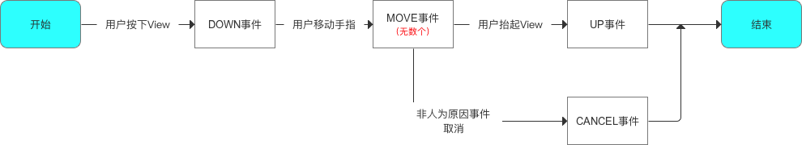

也就是说，当一个 **MotionEvent** 产生后，系统需要把这个事件传递给一个具体View去处理。


---

## 什么是事件分发？

要知道什么是事件分发，其实也就是对MotionEvent 事件的分发过程，也就是当一个 手指 按下之后，系统需要把这个事件传递给一个具体的 View,而这个传递的过程就是分发过程。

**分发顺序也就是 Activity(Window)-> ViewGroup -> View.**


## 三大方法： - >(入门)

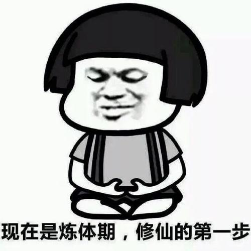

### 说到分发过程，就不得不说这三个方法了：

1. **dispatchTouchEvent,**
2. **onInterceptTouchEvent**
3. **onTouchEvent**

先介绍一下这三个方法分别是干啥的：

**dispatchTouchEvent**

> 用来进行事件的分发，如果事件能够传递给当前View，那么此方法一定会被调用，返回结果受当前View 的 onTouchEvent 和 下级View的 dispatchTouchEvent 方法的影响，表示是否消耗当前事件。

**onInterceptTouchEvent**

> 在 dispatchTouchEvent内部调用，用来判断是否拦截某个事件，如果当前View拦截了某个事件，那么在同一个事件序列中，此方法不会被再次调用，返回结果表示是否拦截当前事件。

**onTouchEvent**

> 在 'dispatchTouchEvent '方法中调用，用来处理点击事件，返回结果表示是否消耗当前事件，如果不消耗，则在同一个事件序列中，当前View 无法再次接受到事件。

用一个图来解释

> `√` 表示有该方法。
>
> `X` 表示没有该方法。

|   类型   |       相关方法        | ViewGroup | View |
| :------: | :-------------------: | :-------: | :--: |
| 事件分发 |  dispatchTouchEvent   |     √     |  √   |
| 事件拦截 | onInterceptTouchEvent |     √     |  X   |
| 事件消费 |     onTouchEvent      |     √     |  √   |

看到这，不知道你们有没有这个疑问，为啥View会有 dispatchTouchEvent 方法？

> 一个View 可以注册很多监听器吧，例如单击，长按，触摸事件(onTouch)，并且View 本身也有 onTouchEvent 方法，那么问题来了，这么多事件相关的方法应该由谁管理，所以View也会有这个 方法。

他们之间的关系我们可以通过以下的伪代码来看：

```java
// 点击事件产生后，会直接调用dispatchTouchEvent（）方法
public boolean dispatchTouchEvent(MotionEvent ev) {

    //代表是否消耗事件
    boolean consume = false;


    if (onInterceptTouchEvent(ev)) {
    //如果onInterceptTouchEvent()返回true则代表当前View拦截了点击事件
    //则该点击事件则会交给当前View进行处理
    //即调用onTouchEvent (）方法去处理点击事件
      consume = onTouchEvent (ev) ;

    } else {
      //如果onInterceptTouchEvent()返回false则代表当前View不拦截点击事件
      //则该点击事件则会继续传递给它的子元素
      //子元素的dispatchTouchEvent（）就会被调用，重复上述过程
      //直到点击事件被最终处理为止
      consume = child.dispatchTouchEvent (ev) ;
    }

    return consume;
   }
```

通过上面的伪代码我们可以发现，对于一个根 **ViewGroup** 来说，点击事件产生后，首先会传递给它，这时他的 **dispatchTouEvent** 就会调用，如果这个 **ViewGroup** 的 **onInterceptTouchEvent**方法返回true，就表示它要拦截当前事件，接着事件就会交给这个 **ViewGroup** 处理，即它的 **onTouchEvent** 方法会被调用，如果这个 **ViewGroup** 的**onInterceptTouchEvent** 方法返回false 就表示它不拦截当前事件，这时当前事件就会继续传递给它的 子元素，接着子元素  **dispatchTouEvent**   方法就会被调用。如此反复知道事件最终被处理。

用一张搬运过来的事件分发流程图来说明一下：

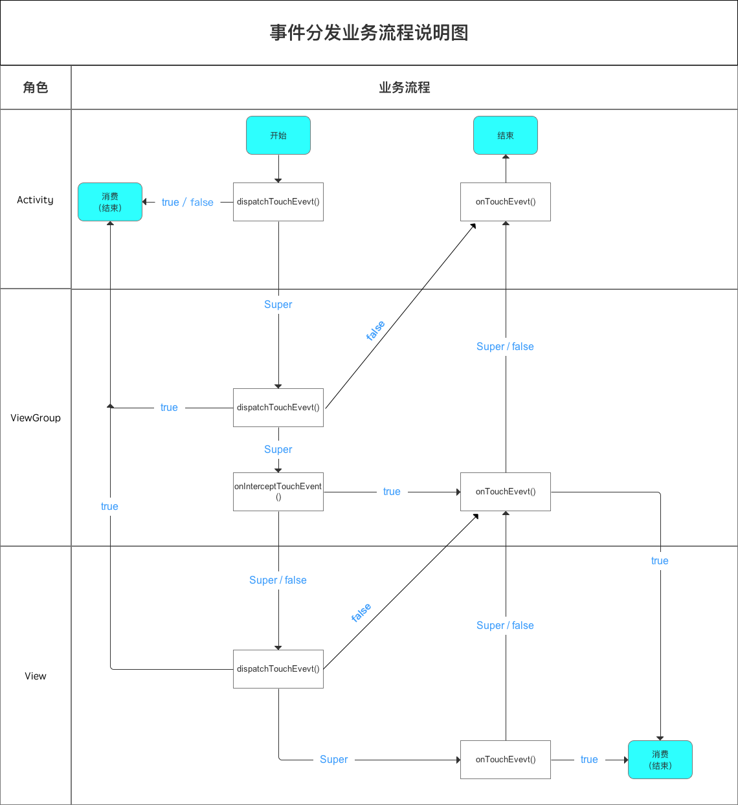

当一个View需要处理事件时，如果它设置了 OnTouchListener, 那么 OnTouchListener 中的 onTouch 方法会被回调。这时事件如何处理还要看 onTouch 的返回值，如果返回false,则当前View 的onTouchEvent 方法会被调用；如果返回 true,那么 onTouchEvent 方法将不会被调用。由此可见，给View设置 onTouchListener，其优先级比 onTouchEvent 还要高。在 onTouchEvent 方法中，如果当前设置有 onClickListener,那么它的 onClick 方法会被调用。可以看出，平时我们常用的 onClickListener，其优先度最低，即处于事件传递的尾端.

通过以下源码即可看出：

```java
public boolean dispatchTouchEvent(MotionEvent event) {
        ......
        ListenerInfo li = mListenerInfo;
        if (li != null && li.mOnTouchListener != null
                && (mViewFlags & ENABLED_MASK) == ENABLED
                && li.mOnTouchListener.onTouch(this, event)) {
            result = true;
        }
        if (!result && onTouchEvent(event)) {
            result = true;
        }
        ......
        return result;
}
```


**关于事件传递机制，我们可以总结出以下结论，根据这些结论能更好的理解整个传递机制：(摘录自Android开发艺术探索)**

1. 同一个事件序列是指从手指接触屏幕的那一刻起，到手指离开屏幕的那一刻结束，在这个过程中所产生的的一系列时间，这个事件序列以 **down** 事件开始，中间含有数量不定的 **move** 事件，最终以 **up** 事件结束。
2. 正常情况下，一个事件序列只能被一个 View 拦截且消耗。这一条原因可以参考（3），因为一旦一个元素拦截了某次事件，那么同一个事件序列内的所有事件都会直接交给它处理，因此同一个事件序列中的事件不能分别由两个 View同时处理，但是通过特殊手段可以做到，比如一个 **View** 将本该自己处理的事件 通过 **onTouchEvent** 强行传递给其他View处理。
3. 某个View一旦决定拦截，那么这一个事件序列都只能由它来处理(如果事件序列能够传递给它的话)，并且它的 **onInterceptTouchEvent** 不会再被调用。这条也很好理解，就是说当一个 View 决定拦截一个事件后，那么系统会把同一个事件序列内的其他方法都直接交给它来处理，因此就不再调用这个View的 **onInterceptTouchEvent** 去询问它是否要拦截了。
4. 某个View 一旦开始处理事件，如果它不消耗 **ACTION_DOWN** 事件( **onTOuchEvent** 返回了 **false** ) ，那么同一事件序列中的其他事件都不会交给 它来处理，并且事件将重新交由它的父元素去处理，即父元素的 **onTouchEvent** 会被调用。意思就是事件一旦交给一个 View 处理，那么它就必须消耗掉，否则同一事件序列中剩下的事件就不再交给它来处理了，这就好比上级交给程序猿一件事，如果事情没有处理好，短期内上级就不敢再把事情交给程序猿去做了。二者道理差不多。
5. 如果View 不消耗除 **ACTION_DOWN** 以外的其他事件，那么这个点击事件会消失，此时父元素的 **onTouchEvent** 并不会被调用，并且当前 **View** 可以持续收到后续的事件，最终这些消失的点击事件会传递给 Activity 处理。
6. **ViewGroup** 默认不拦截任何事件。Android 源码中ViewGroup 的 **onInterceptTouchEvent** 方法默认返回false.
7. View 没有 **onInterceptTouchEvent** 方法，一旦有点击事件传递给它，那么它的 onTouchEvent 方法就会被调用。
8. View 的 **onTouchEvent** 默认都会消耗事件(返回true)，除非它是不可点击的(clickable和longClickable同时为false).View 的 **longClickable** 属性默认为 false,**clickable** 属性要分情况，比如Button 的clickable 属性默认为true，而 TextView 的 clickable 属性默认为 false.
9. View 的 enable 属性不受影响 **onTouchEvent** 的 默认返回值，哪怕一个 View 是 disable 状态的，只要它的 **clickable** 或者 **longClickable** 有一个 为 true,那么它的 **onTouchEvent** 就返回 true.
10. **onClick** 会发生的前提是当前View 是可点击的，并且它收到了 down 和 up 的事件。
11. 事件传递过程是由外而向的，即事件总是先传递给父元素，然后再由父元素分发给子View，通过**requestDisallowInterceptTouchEvent** 方法可以在子元素中干预父元素的事件分发过程，但是 ACTION_DOWN 事件除外。


## 实例： ->（**实践**）

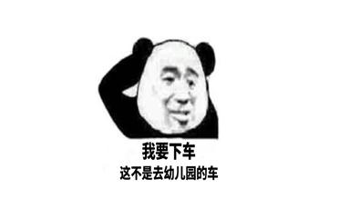

**结合上面的结论，我们来用实例来演示一下**

首先用这样一个图来看


这是一个简单的布局，Activity里面一个LinearLayout,用来代替ViewGroup，内部是一个Button,没什么说的。

我们要从如下几个方面入手，探究上面那些结论。

1. 默认情况下的事件分发
2. 拦截时的分发情况
3. 如果viewagroup 不拦截 Down事件，即还是 Button 来处理，但它拦截接下来的move事件(也就是半路拦截)，那么接下来情况又会是咋样？
4. 如果全部都不消费事件，事件最终由谁来安排。
5. onTouch中返回 true或者false,对onTouchEvent有什么影响吗。


上代码啦：

首先继承自 **LinearLayout**，为了重写相应的 三大方法。

```java
/**
 * @author Petterp on 2019/7/2
 * Summary:重写LinearLayout相应方法
 * 邮箱：1509492795@qq.com
 */
public class LinearLayoutView extends LinearLayout {
    public LinearLayoutView(Context context) {
        super(context);
    }

    public LinearLayoutView(Context context, AttributeSet attrs) {
        super(context, attrs);
    }

    /**
     * 事件分发
     *
     * @param ev
     * @return 是否消费当前事件
     * true-> 消费事件，后续事件继续分发到该view
     * false->
     */
    @Override
    public boolean dispatchTouchEvent(MotionEvent ev) {
        return super.dispatchTouchEvent(ev);
    }

    /**
     * 事件拦截，即自己处理事件
     *
     * @param ev
     * @return 是否拦截当前事件
     * true->事件停止传递，执行自己onTouchEvent,该方法后续不再调用
     * false -> 事件继续向下传递，调用子view.dispatchTouchEvent(),该方法后续仍被调用
     */
    @Override
    public boolean onInterceptTouchEvent(MotionEvent ev) {
        Log.e("demo", "viewgroup-onInterceptTouchEvent: "+ ViewActivity.mode);
        return ViewActivity.mode;
    }

    /**
     * 处理点击事件
     *
     * @param event
     * @return 是否消费当前事件
     * true-> 事件停止传递，后续事件由其处理
     * false-> 不处理,事件交由父 onTouchEvent()处理，此view不再接受此事件列的其他事件
     */
    @Override
    public boolean onTouchEvent(MotionEvent event) {
        return super.onTouchEvent(event);
    }
}
```


**接着是Activity:**

```java
public class ViewActivity extends AppCompatActivity {
    //mode标记位
    public static boolean mode=false;


    @SuppressLint("ClickableViewAccessibility")
    @Override
    protected void onCreate(Bundle savedInstanceState) {
        super.onCreate(savedInstanceState);
        setContentView(R.layout.activity_view);
        Button btn_1=findViewById(R.id.btn_t1);
        LinearLayoutView linearLayout=findViewById(R.id.ln_group);

        //LinearLayout 即viewGroup
        linearLayout.setOnClickListener(v -> Log.e("demo","viewgroup-onClick"));
        linearLayout.setOnTouchListener((v, event) -> {
            switch (event.getAction()){
                case MotionEvent.ACTION_DOWN:
                    Log.e("demo","viewgroup-手指按下");
                    break;
                case MotionEvent.ACTION_UP:
                    Log.e("demo","viewgroup-手指放开");
                    break;
                case MotionEvent.ACTION_MOVE:
                    Log.e("demo","viewgroup-手指移动");
                    break;
            }
            return false;
        });


        //button 即子view
        btn_1.setOnClickListener(v -> Log.e("view-demo","onClick"));
        btn_1.setOnTouchListener((v, event) -> {
            switch (event.getAction()){
                case MotionEvent.ACTION_DOWN:
                    Log.e("demo","view-手指按下");
                    break;
                case MotionEvent.ACTION_UP:
                    Log.e("demo","view-手指放开");
                    break;
                case MotionEvent.ACTION_MOVE:
                    Log.e("demo","view-手指移动");
                    break;
                case MotionEvent.ACTION_CANCEL:
                    Log.e("demo","view-被父view截断了");
                    break;
            }
            return false;
        });
    }

    /**
     * 重写Activity onTouchEvent,
     * 模拟子view不消费事件时的处理情况
     * @param event 
     * @return
     */
    @Override
    public boolean onTouchEvent(MotionEvent event) {
        Log.e("demo","Activity-自己消化");
        return super.onTouchEvent(event);
    }
}
```

相应的注释简洁明了，不用多说了吧。

**xml**

```xml
<?xml version="1.0" encoding="utf-8"?>
<com.petterp.studybook.View.LinearLayoutView xmlns:android="http://schemas.android.com/apk/res/android"
    xmlns:custom="http://schemas.android.com/apk/res-auto"
    xmlns:tools="http://schemas.android.com/tools"
    android:id="@+id/ln_group"
    android:layout_width="match_parent"
    android:layout_height="match_parent"
    android:orientation="vertical"
    tools:context=".View.ViewActivity">

    <Button
        android:id="@+id/btn_t1"
        android:layout_width="wrap_content"
        android:layout_height="wrap_content"
        android:text="Button"
        tools:ignore="HardcodedText" />
</com.petterp.studybook.View.LinearLayoutView>
```

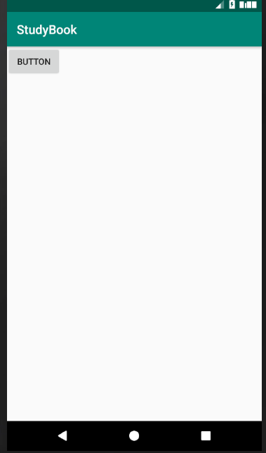

首先看看默认情况下的事件分发过程：

手指-> 点击Button,再点击空白处(即Viewgroup)。观察日志打印：

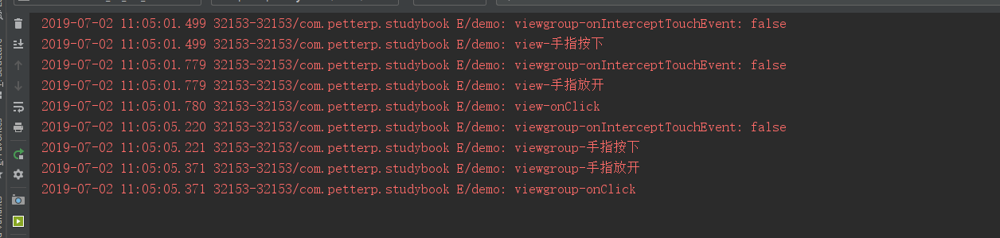

结论：默认情况下，**viewgroup **拦截器返回false,事件会传递到子view的 **dispatchTouchEvent** 然后继续分发，直到最后被 子view 的**onTouchEvent** 所消费，这时候会调用 **onclick**方法，所以 **onclick**处于优先级最低。

---


**拦截情况下的事件分发，比如，ViewGroup 的onInterceptTouchEvent返回true呢？**

更改代码

```java
//mode标记位
public static boolean mode=true;
```

默认这里是false,当然这个是我自己写的一个标记位，真实情况肯定不是这样。只是为了模拟效果。现在改为true,这样的话LinearLayout 的onInterceptTouchEvent 将返回true,也就是ViewGroup 消费了此事件。

手指 -> 点击Button,再点击 空白处(即ViewGroup)，观察日志打印：

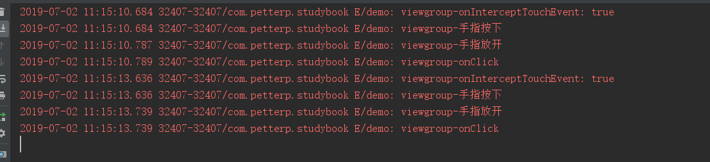

可以发现，viewGroup已经消费了此次事件，这时无论点击什么位置，事件都不会传递到子view。

结论：当 **dispatchTouchEvent** 拦截了此次事件，那么接下来的事件序列都不会向下传递。都由此view处理。


---

**如果我们先不拦截，当点击之后再拦截子view事件，这时候又会是什么情况？**

修改代码：

```java
//mode标记位
public static boolean mode=false;

...
btn_1.setOnTouchListener((v, event) -> {
      switch (event.getAction()){
          case MotionEvent.ACTION_DOWN:
              Log.e("demo","view-手指按下");
              mode=true;
              break;
        ...
      }
      return false;
  });
```

手指 -> button,然后稍微移动一下松开：

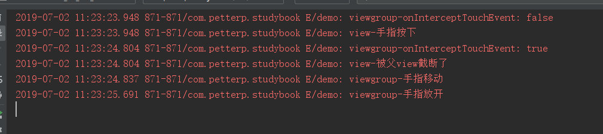

是不是发现此次事件序列在被拦截时传递了一个 ACTION_CANCEL 给子view，而以后后续事件都不会再向下传递。

结论：**当一个事件 被 onInterceptTouchEvent 返回true 中途拦截时，会传递 ACTION_CANCEL 给view的 onTouchEvent方法。后续的 move等事件，会直接传递给 拦截者 的 onTouchEvent( ) 方法。而且后续事件不会在传递给 其 onInterceptTouchEvent 方法，该方法一旦返回一次true，就再也不会被调用了。**


---

**如果都不处理，消费此次事件，会是怎样的呢？**

修改代码：

这里为了演示，因为默认的 onInterceptTouchEvent 返回true，懒得修改Button,所以我们尝试用ViewGroup拦截事件，然后不消费它，也就是 onTOuchEvent 返回false。

```java
//mode标记位
public static boolean mode=false;

LinearLayoutView ->更改代码
  public boolean onTouchEvent(MotionEvent event) {
        Log.e("demo","viewgroup-我不消费");
        return false;
    }
```

手指-> button 按下轻轻移动：

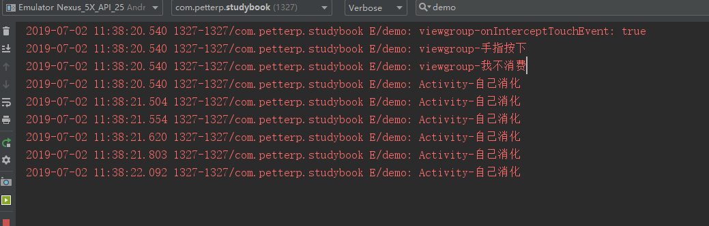

结论：**这也就是我们常说的责任链模式，层层传递事件，决定分发dispatchTouchEvent，最终由onTouchEvent接收，如果子不消费，就继续向上，直到Activity自己消费。Activity这里，其实无论返回true还是false，都会消费事件。**

---

**onTouch中返回 true或者false,对onTouchEvent有什么影响吗？**

先将代码恢复如初，然后更改

```java
Activity: 
linearLayout.setOnTouchListener((v, event) -> {
            switch (event.getAction()){
                case MotionEvent.ACTION_DOWN:
                    Log.e("demo","viewgroup-手指按下");
                    break;
                case MotionEvent.ACTION_UP:
                    Log.e("demo","viewgroup-手指放开");
                    break;
                case MotionEvent.ACTION_MOVE:
                    Log.e("demo","viewgroup-手指移动");
                    break;
            }
            return true;
        });

LinearLayout:
  @Override
    public boolean onInterceptTouchEvent(MotionEvent ev) {
        boolean mode=super.onInterceptTouchEvent(ev);
        Log.e("demo", "viewgroup-onInterceptTouchEvent: "+ mode);
        return false;
    }


 @Override
    public boolean onTouchEvent(MotionEvent event) {
        boolean mode=super.onTouchEvent(event);
        Log.e("demo","viewgroup-onTouchEvent");
        return mode;
    }
```

***手指-> 按下空白区域再松开：***

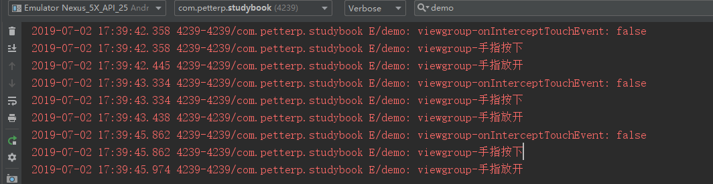

接着修改代码

```java
Activity: 
 linearLayout.setOnTouchListener((v, event) -> {
         	...
            return false;
        });
```

***手指-> 按下空白区域再松开：***

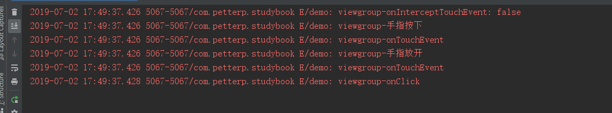

**结论：可以发现 onTouch方法优先于 onTouchEvent执行。具体的原因可以看我下一篇 Android事件分发源码解析。**


# Android事件分发全面解析2-源码解析。

## 源码解析：->（探密）

有了上面的概念及Demo的亲自体验，那么接下来我们从源码出发，知根知底，看一下究竟。

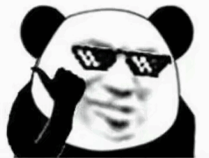

Android中事件分发顺序：**Activity（Window） -> ViewGroup -> View**

其中：

- super: 调用父类方法；
- true:消费事件，即事件不继续向下传递；
- false:不消费事件

所以，我们的重心也就是 **Activity的分发机制，ViewGroup 的分发机制，View的分发机制**


### Activity的事件分发解析：

当一个点击事件发生时，事件最先传到Activity 的 dispatchTouchEvent() 进行事件分发。

我们来看一下具体的源码：

```java
public boolean dispatchTouchEvent(MotionEvent ev) {
   	//关注点1
    //一般事件列开始都是 DOWN ，所以这里基本都是 true
    if (ev.getAction() == MotionEvent.ACTION_DOWN) {
        //关注点2
        onUserInteraction();
    }
    //关注点3
    if (getWindow().superDispatchTouchEvent(ev)) {
        return true;
    }
    return onTouchEvent(ev);
}
```

**关注点1** ：一般这里开始都是 DOWN,所以这里返回 true,执行onUserInteraction();

所以我们直接跳到 **关注点2**：

```java
/**
 * Called whenever a key, touch, or trackball event is dispatched to the
 * activity.  Implement this method if you wish to know that the user has
 * interacted with the device in some way while your activity is running.
 * This callback and {@link #onUserLeaveHint} are intended to help
 * activities manage status bar notifications intelligently; specifically,
 * for helping activities determine the proper time to cancel a notfication.
 *
 * <p>All calls to your activity's {@link #onUserLeaveHint} callback will
 * be accompanied by calls to {@link #onUserInteraction}.  This
 * ensures that your activity will be told of relevant user activity such
 * as pulling down the notification pane and touching an item there.
 *
 * <p>Note that this callback will be invoked for the touch down action
 * that begins a touch gesture, but may not be invoked for the touch-moved
 * and touch-up actions that follow.
 *
 * @see #onUserLeaveHint()
 */
public void onUserInteraction() {
}
```

可以看出：

- 该方法为null方法
- 当次Activity 在栈顶时，触屏点击按 home,back,menu键等都会触发此方法
- 所以onUserInteraction 主要用于屏幕保护。

**关注点3：**

- Window类是抽象类，而且PhoneWindow 类是 Window 类唯一的实现类。

- superDispatchTouchEvent(ev) 是抽象方法

- 我们通过PhoneWindow来看一下 superDispatchTouchEvent的作用：

- ```java
  @Override
  public boolean superDispatchTouchEvent(MotionEvent event) {
      return mDecor.superDispatchTouchEvent(event);
      //mDecor是DecorView的实例
  //DecorView是视图的顶层view，继承自FrameLayout，是所有界面的父类
  }
  ```

- 接着我们再看  mDecor.superDispatchTouchEvent(event)

- > ```java
  > public boolean superDispatchTouchEvent(MotionEvent event) {
  >     //DecorView 继承自 FragmentLayout
  >     //所以它的父类也是ViewGroup
  >     //所以super.dispatchTouchEvent(event)调用的其实也就是 ViewGroup的 dispatchTouchEvent
  >     return super.dispatchTouchEvent(event);
  > }
  > ```

**所以：** 执行getWindow().superDispatchTouchEvent(ev)实际上是执行了 ViewGroup.dispatchEvent(event)

再回头看开始的源码，

```java
public boolean dispatchTouchEvent(MotionEvent ev) {
   	//关注点1
    //一般事件列开始都是 DOWN ，所以这里基本都是 true
    if (ev.getAction() == MotionEvent.ACTION_DOWN) {
        //关注点2
        onUserInteraction();
    }
    //关注点3
    if (getWindow().superDispatchTouchEvent(ev)) {
        return true;
    }
    return onTouchEvent(ev);
}
```

由于一般事件列都是 DOWN，所以这里返回true,基本上都会进 **getWindow().superDispatchTouchEvent(ev)**判断，所以 执行 **Activity.dispatchTouchEvent** 其实也就是执行 **ViewGroup.dispatchTouchEvent(event)**，这样事件就从**Activity** 传递到 **ViewGroup**.


#### **总结**：

当一个点击事件发生时，调用顺序如下：

- 最先传入Activity的 dispatchTouchEvent()进行事件分发
- 调用 window 类实现类 phoneWindow的 superDispatchTouchEvent()
- 调用 Decoorvier 的 superDispatchTouchEvent()
- 最终调用 Decoorvier 父类的 dispatchTouchEvent，也就是ViewGroup的 dispatchTouchEvent();                                                                                                                                                                                                                                                                                                                                                                                                                                                                                                                                                                                                                                                                                                                                                                                                                                                                                                                                                                                                                                                                                                                                                                                                                                                                                                                                                                                                                                                                                                                                                                                                                                                                                                                                                                                                                                                                                                                                                                                                                                                                                                                                                                                                                                                                                                                                                                                                                                                                                                                                                                                                                                                                                                                                                                                                                                                                                                                                                                                                                                                                                                                                                                                                                                                                                                                                                                                                                                                                                                                                                                                                                                                                                                                                                                                                                                                                                                                                                                                                                                                                                                                                                                                                                                                                                                                                                                                                                                                                                                                                                                                                                                                                                                                                                                                                                                                                                                                                                                                                                 

#### 简单来说，也就是

当一个点击发生后，事件最先传到 Activity的 dispatchTouchevent进行事件分发，最终调用了ViewGroup的 dispathchTouchevent。这样事件就从Activity 传递到了ViewGroup.


### ViewGroup 的事件分发解析：

#### dsispatchTouchEven() 源码分析：

```java
//发生Action_DOWN事件或者已经发生过 ACTION_DOWN,并且将 mFirstTouchTarget赋值，才进入此区域，主要目的是拦截器。
//mFirstTouchTarget！=null也就是，当事件由ViewGroup的子元素成功处理时，mFirstTouchTarget会被复制并指向子元素。也就是说，当ViewGroup不拦截此事件并将此事件交给子元素处理时，mFirstTouchTarget！=null
final boolean intercepted;
if (actionMasked == MotionEvent.ACTION_DOWN
        || mFirstTouchTarget != null) {
        //disallowIntercept 是否禁用事件拦截器的功能(默认false)
        //可以在子view通过调用 requestDisallowInterceptTouchEvent 方法对这个值进行修改，不让该 view 拦截事件
    final boolean disallowIntercept = (mGroupFlags & FLAG_DISALLOW_INTERCEPT) != 0;
    //默认情况进入该方法
    if (!disallowIntercept) {
    	//调用拦截方法
        intercepted = onInterceptTouchEvent(ev);
        ev.setAction(action); // restore action in case it was changed
    } else {
        intercepted = false;
    }
} else {
    // There are no touch targets and this action is not an initial down
    // so this view group continues to intercept touches.
    //当没有触摸targets,且不是down事件时，开始持续拦截触摸
    intercepted = true;
}
```

上面这段内容主要就是为判断是否拦截。如果当前事件为 MotionEcent.ACTION_DOWN或 mFirstTouchTarget！=null，则进入判断，判断是否拦截。如果不是以上两种情况，即已经是 MOVE或者 别的后续事件，并且之前的事件没有对象进行处理，则设置成 true,开始拦截所有事件。这也就解释了 **如果子view 的onTouchEvent() 方法返回false,那么接下来的一系列事件都不会交给他处理。如果 ViewGroup 的 onInterceptTouchEvent()第一次执行为true,则 mFirstTouchTarget！=null，则也会使得接下来不会调用 onInterceptTouchEvent(),直接将拦截设置为 true**。

当然，这里有一种特殊情况，那就是 FLAG_DISALLOW_INTERCEPT标记位，这个标记位是通过 requestDisallowInterceptTouchEvent 方法来设置的，一般用于子 View中。FLAG_DISALLOW_INTERCEPT一旦设置后，ViewGroup 将无法拦截除了 ACTION_DOWN 以外的其他点击事件。为什么说是除了 ACTION_DOWN 以外的其他事件呢？这是因为 ViewGroup 在分发事件时，如果是 ACTION_DOWN 就会重置 FLAG_DISALLOW_INTERCEPT 这个标记位，将导致子 View 中设置的这个 标记位 无效。因此，当面对 ACTION_DOWN 事件时，ViewGroup 总会调用自己的 onInterceptTouchEvent 方法来询问自己是否要拦截事件。


当ViewGroup不拦截事件的时候，事件会向下分发交由它的子View或ViewGroup进行处理。

```java
//从最底层的父视图开始遍历
//找寻newTouchTarget,即上面的 mFirstTouchTarget
//如果已经存在找寻newTouchTarget,说明正在接受触摸事件，则跳出循环
for (int i = childrenCount - 1; i >= 0; i--) {
    final int childIndex = getAndVerifyPreorderedIndex(
            childrenCount, i, customOrder);
    final View child = getAndVerifyPreorderedView(
            preorderedList, children, childIndex);

  	//如果当前视图无法获取用户焦点,则跳出本次循环
    if (childWithAccessibilityFocus != null) {
        if (childWithAccessibilityFocus != child) {
            continue;
        }
        childWithAccessibilityFocus = null;
        i = childrenCount - 1;
    }

    //如果view不可见，或者触摸的坐标点不在 view的范围内，则跳出本次循环
    if (!canViewReceivePointerEvents(child)
            || !isTransformedTouchPointInView(x, y, child, null)) {
        ev.setTargetAccessibilityFocus(false);
        continue;
    }

    newTouchTarget = getTouchTarget(child);
    
    //已经开始接受触摸事件，并退出整个循环
    if (newTouchTarget != null) {
        // Child is already receiving touch within its bounds.
        // Give it the new pointer in addition to the ones it is handling.
        newTouchTarget.pointerIdBits |= idBitsToAssign;
        break;
    }

    //重置取消或抬起标志位
    //如果触摸位置再 child 的区域内，则把时间分发给 View 或 ViewGroup
    resetCancelNextUpFlag(child);
    if (dispatchTransformedTouchEvent(ev, false, child, idBitsToAssign)) {
        // 获取TouchDown时间点
        mLastTouchDownTime = ev.getDownTime();
        if (preorderedList != null) {
            // 获取TouchDown的Index
            for (int j = 0; j < childrenCount; j++) {
                if (children[childIndex] == mChildren[j]) {
                    mLastTouchDownIndex = j;
                    break;
                }
            }
        } else {
            mLastTouchDownIndex = childIndex;
        }
        //获取TouchDown 的x,y坐标
        mLastTouchDownX = ev.getX();
        mLastTouchDownY = ev.getY();
        //添加TouchTarget,则mFirstTouchTarget != null。
        newTouchTarget = addTouchTarget(child, idBitsToAssign);
        //表示以及分发给NewTouchTarget
        alreadyDispatchedToNewTouchTarget = true;
        break;
    }
```

上面这段代码逻辑也很清晰，首先遍历 ViewGroup 的所有子元素，然后判断子元素是否能够接收到点击事件。是否能够接受点击事件主要由两点来衡量；子元素是否在播动画和点击事件的坐标是否落在子元素的区域内。如果某个子元素满足这两个条件，那么事件就会传递给它来处理。可以看到， dispatchTransformedTouchEvent 实际上调用的就是子元素的 dispatchTouchEvent 方法，在它的内部有如下一段内容，而在上面的代码中，child 传递的 不是 null,因此他会直接调用子元素的dispatchTouchEvent 方法，这样事件就交由子元素处理了。从而完成了一轮事件分发。

```java
if (child == null) {
    handled = super.dispatchTouchEvent(event);
} else {
    handled = child.dispatchTouchEvent(event);
}
```

如果子元素的 dispatchTouchEvent 返回 true，这时我们暂时不用考虑 事件在子元素内部是怎么分发的，那么 mFritsTouchTarget 就会被赋值同时跳出 for循环，如下所示：

```java
//添加TouchTarget,则 mFirstTouchTarget!=null
newTouchTarget = addTouchTarget(child, idBitsToAssign);
//表示以及分发给 NewTouchTarget
alreadyDispatchedToNewTouchTarget = true;
break;
```

其中 **addTouchTarget(child, idBitsToAssign)**  内部完成 mFirstTouchTarget 被赋值。如果 mFirstTouchTarget为空，将会让ViewGroup 默认拦截所有操作。如果遍历所有子 View或ViewGroup,都没有消费事件，这包含两种情况：第一种是ViewGroup没有子元素；第二种是子元素处理了点击事件，但是在dispatchTouchEvent中返回了false,就像我们最上面写的那个demo一样，是因为在onTOuchEvent中返回了false,这个时候，ViewGroup会自己处理点击事件。

#### 总结：

- Android事件分发是先传递到ViewGroup,再传递到View

- 在ViewGroup 中通过 onInterceptTouchEvent() 对事件传递进行拦截

- > 1.   onInterceptTouchEvent 返回值true代表拦截
  > 2. false代表继续传递(默认false)
  > 3. 子view中如果将传递的时间消费掉，ViewGroup 中将无法接收到任何事件。


### View事件分发解析：

同样，我们还是先分析下 dsispatchTouchEven()方法：

```java
public boolean dispatchTouchEvent(MotionEvent event) {
    ...
    boolean result = false;
    ...
    if (onFilterTouchEventForSecurity(event)) {
       ...
        //noinspection SimplifiableIfStatement
        ListenerInfo li = mListenerInfo;
        if (li != null && li.mOnTouchListener != null
                && (mViewFlags & ENABLED_MASK) == ENABLED
                && li.mOnTouchListener.onTouch(this, event)) {
            result = true;
        }

        if (!result && onTouchEvent(event)) {
            result = true;
        }
    }

    return result;
}
```

从源码中可以发现：只有4个条件都为真，dispatchTouchEvent() 才返回true;否则执行 onTouchEvent(event)方法：

> 1. li != null
> 2. li.mOnTouchListener != null
> 3. (mViewFlags & ENABLED_MASK) == ENABLED
> 4. li.mOnTouchListener.onTouch(this, event))

**li != null **

> ListenerInfo是View的一个静态类，包括了几个 Listener,比如TouchListener,FocusChangeListener等，一般情况下它均不为null,它不是我们今天讨论的核心，所以不用多关注它。

**li.mOnTouchListener != null**

> mOnTouchListener  是由View设置的，比如 mButton.setTouchListener().所以如果View 设置了 Touch 监听，那么 mOnTouchListener 不为null.
>
> ```java
> //mOnTouchListener是在View类下setOnTouchListener方法里赋值的
> public void setOnTouchListener(OnTouchListener l) { 
> 
> //即只要我们给控件注册了Touch事件，mOnTouchListener就一定被赋值（不为空）
>  mOnTouchListener = l;  
> }
> ```

**(mViewFlags & ENABLED_MASK) == ENABLED**

> 该条件是判断当前点击的控件是否 enable,由于很多view默认是enable ，所以该条件默认为true

**li.mOnTouchListener.onTouch(this, event))**

判断TouchListener 的onTouch() 方法是否消耗了Touch 事件。返回值为 true表示消费该事件，false表示未消费。


如果上面全部满足，那么result 为true,否则为 false，调用 onTouchEvent()方法。

```java
public boolean onTouchEvent(MotionEvent event) {
    final float x = event.getX();
    final float y = event.getY();
    final int viewFlags = mViewFlags;
    final int action = event.getAction();

    final boolean clickable = ((viewFlags & CLICKABLE) == CLICKABLE
            || (viewFlags & LONG_CLICKABLE) == LONG_CLICKABLE)
            || (viewFlags & CONTEXT_CLICKABLE) == CONTEXT_CLICKABLE;

    if ((viewFlags & ENABLED_MASK) == DISABLED) {
        if (action == MotionEvent.ACTION_UP && (mPrivateFlags & PFLAG_PRESSED) != 0) {
            setPressed(false);
        }
        mPrivateFlags3 &= ~PFLAG3_FINGER_DOWN;
        // A disabled view that is clickable still consumes the touch
        // events, it just doesn't respond to them.
        return clickable;
    }
    if (mTouchDelegate != null) {
        if (mTouchDelegate.onTouchEvent(event)) {
            return true;
        }
    }
	//如果该控件是可以点击就会进入到下两行的switch判断中
    if (clickable || (viewFlags & TOOLTIP) == TOOLTIP) {
        switch (action) {
            case MotionEvent.ACTION_UP:
                mPrivateFlags3 &= ~PFLAG3_FINGER_DOWN;
                if ((viewFlags & TOOLTIP) == TOOLTIP) {
                    handleTooltipUp();
                }
                if (!clickable) {
                    removeTapCallback();
                    removeLongPressCallback();
                    mInContextButtonPress = false;
                    mHasPerformedLongPress = false;
                    mIgnoreNextUpEvent = false;
                    break;
                }
                boolean prepressed = (mPrivateFlags & PFLAG_PREPRESSED) != 0;
                //经过种种判断，会执行到关注点1的performeCLick() 方法
                //请往下看关注点1
                if ((mPrivateFlags & PFLAG_PRESSED) != 0 || prepressed) {
                    // take focus if we don't have it already and we should in
                    // touch mode.
                    boolean focusTaken = false;
                    if (isFocusable() && isFocusableInTouchMode() && !isFocused()) {
                        focusTaken = requestFocus();
                    }

                    if (prepressed) {
                        // The button is being released before we actually
                        // showed it as pressed.  Make it show the pressed
                        // state now (before scheduling the click) to ensure
                        // the user sees it.
                        setPressed(true, x, y);
                    }

                    if (!mHasPerformedLongPress && !mIgnoreNextUpEvent) {
                        // This is a tap, so remove the longpress check
                        removeLongPressCallback();

                        // Only perform take click actions if we were in the pressed state
                        if (!focusTaken) {
                            // Use a Runnable and post this rather than calling
                            // performClick directly. This lets other visual state
                            // of the view update before click actions start.
                            if (mPerformClick == null) {
                                mPerformClick = new PerformClick();
                            }
                            if (!post(mPerformClick)) {
                                //关注点1
                                performClickInternal();
                            }
                        }
                    }

                    if (mUnsetPressedState == null) {
                        mUnsetPressedState = new UnsetPressedState();
                    }

                    if (prepressed) {
                        postDelayed(mUnsetPressedState,
                                ViewConfiguration.getPressedStateDuration());
                    } else if (!post(mUnsetPressedState)) {
                        // If the post failed, unpress right now
                        mUnsetPressedState.run();
                    }

                    removeTapCallback();
                }
                mIgnoreNextUpEvent = false;
                break;

            case MotionEvent.ACTION_DOWN:
                if (event.getSource() == InputDevice.SOURCE_TOUCHSCREEN) {
                    mPrivateFlags3 |= PFLAG3_FINGER_DOWN;
                }
                mHasPerformedLongPress = false;

                if (!clickable) {
                    checkForLongClick(0, x, y);
                    break;
                }

                if (performButtonActionOnTouchDown(event)) {
                    break;
                }

                // Walk up the hierarchy to determine if we're inside a scrolling container.
                boolean isInScrollingContainer = isInScrollingContainer();

                // For views inside a scrolling container, delay the pressed feedback for
                // a short period in case this is a scroll.
                if (isInScrollingContainer) {
                    mPrivateFlags |= PFLAG_PREPRESSED;
                    if (mPendingCheckForTap == null) {
                        mPendingCheckForTap = new CheckForTap();
                    }
                    mPendingCheckForTap.x = event.getX();
                    mPendingCheckForTap.y = event.getY();
                    postDelayed(mPendingCheckForTap, ViewConfiguration.getTapTimeout());
                } else {
                    // Not inside a scrolling container, so show the feedback right away
                    setPressed(true, x, y);
                    checkForLongClick(0, x, y);
                }
                break;

            case MotionEvent.ACTION_CANCEL:
                if (clickable) {
                    setPressed(false);
                }
                removeTapCallback();
                removeLongPressCallback();
                mInContextButtonPress = false;
                mHasPerformedLongPress = false;
                mIgnoreNextUpEvent = false;
                mPrivateFlags3 &= ~PFLAG3_FINGER_DOWN;
                break;

            case MotionEvent.ACTION_MOVE:
                if (clickable) {
                    drawableHotspotChanged(x, y);
                }

                // Be lenient about moving outside of buttons
                if (!pointInView(x, y, mTouchSlop)) {
                    // Outside button
                    // Remove any future long press/tap checks
                    removeTapCallback();
                    removeLongPressCallback();
                    if ((mPrivateFlags & PFLAG_PRESSED) != 0) {
                        setPressed(false);
                    }
                    mPrivateFlags3 &= ~PFLAG3_FINGER_DOWN;
                }
                break;
        }
	//如果该控件是可以点击的，就一定返回true
        return true;
    }
//如果该控件不可以点击，就一定返回false
    return false;
}
```

关注点1：

```java
private boolean performClickInternal() {
    // Must notify autofill manager before performing the click actions to avoid scenarios where
    // the app has a click listener that changes the state of views the autofill service might
    // be interested on.
    notifyAutofillManagerOnClick();

    return performClick();
}
```

```java
public boolean performClick() {
    // We still need to call this method to handle the cases where performClick() was called
    // externally, instead of through performClickInternal()
    notifyAutofillManagerOnClick();

    final boolean result;
    final ListenerInfo li = mListenerInfo;
    if (li != null && li.mOnClickListener != null) {
        playSoundEffect(SoundEffectConstants.CLICK);
        li.mOnClickListener.onClick(this);
        result = true;
    } else {
        result = false;
    }

    sendAccessibilityEvent(AccessibilityEvent.TYPE_VIEW_CLICKED);

    notifyEnterOrExitForAutoFillIfNeeded(true);

    return result;
}
```

- 只要li.mOnClickListener！=null与li!=null，就回去调用 onClick方法。

- 那么，mOnclickListener  又是在哪里赋值的呢？

- ```java
  public void setOnClickListener(OnClickListener l) {  
      if (!isClickable()) {  
          setClickable(true);  
      }  
      mOnClickListener = l;  
  }
  ```

当我们通过调用 setOnclickListener 方法来给控件注册一个点击事件时，就会给 mOnclickListener赋值，即回调onClick();

总结：

1. onTouch()的执行高于onClick()，这一点从最上面的Demo都可以看出。

2. 如果在回调onTouch() 里返回false,就会让 dispatchTouchEvent 方法返回false,那么就会执行 onTouchEvent();如果回调了 setOnclickListener() 来给控件注册点击事件的话，最后会在 performClick() 方法里回调 onClick()。 

   > onTouch() 返回false,未消费该事件->执行onTouchEvent()->执行 onClick

   如果在回调 onTOuch()里返回 true,就会让 dispatchTouchEvent 方法返回 true,那么将不会执行 onTouchEvent(),即onClick()，也不会执行；

   > 	onTouch()返回true(该事件被onTouch()消费掉)=dispatchTouchEvent()返回true,即不会再向下传递，也就不会执行onTouchEvent(),不会执行 Onclick()


**onTouch()** 和 **onTouchEvent()** 的区别：

- 这两个方法都是在View 的dispatchTouchEvent 中调用得，但onTouch 优先于 onTouchEvent 执行。

- 如果在onTouch 方法中返回 true 将事件消费掉，onTouchEvent() 将不会在执行。

  ```java
    if (li != null && li.mOnTouchListener != null
                  && (mViewFlags & ENABLED_MASK) == ENABLED
                  && li.mOnTouchListener.onTouch(this, event)) {
              result = true;
          }
  
          if (!result && onTouchEvent(event)) {
              result = true;
          }
  ```

- 因此如果有一个控件是 非 enable 的，那么给它注册 onTouch 事件将永远得不到执行。对于这一类控件，如果我们想要监听它的 touch 事件，就必须通过在该控件中重写 onTOuchEvent 方法来实现。

到了这里，我们的事件分发源码解析也就差不多结束了，如果有什么问题，也欢迎与我讨论。

参阅：

- [GcsSloop](https://www.gcssloop.com/customview/dispatch-touchevent-source)
- Android开发艺术探索