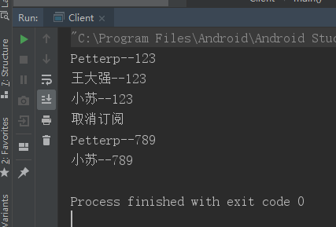

# 观察者模式

观察者模式又被称为 发布-订阅 模式，属于行为型设计模式的一种。

定义：定义对象间一种一对多的依赖关系，每当一个对象改变状态时，则所有依赖它的对象都会得到通知并被自动更新，

观察者模式的结构图如图所示：


在观察者模式中有如下角色：

- Subject: 抽象主题(抽象被观察者)：抽象主题角色把所有观察者对象保存在一个集合里，每个主题都可以有任意数量的观察者。抽象主题提供一个接口，可以增加和删除观察者对象。
- ConcreteSubject: 具体主题(具体被观察者)。该角色将有关状态存入具体观察者对象，再具体主题的内部状态发生改变时，给所有注册过的观察者发送通知。
- Observer: 抽象观察者，是观察者的抽象类。它定义了一个更新接口，使得在得到主题更改通知时更新自己。
- ConcrereObserver：具体观察者，实现抽象观察者定义的更新接口，以便在得到主题更改通知时更新自身状态。

## 简单实现：

关于观察者模式这种发布-订阅的形式，我们可以拿微信公众号来举例。假设微信用户就是观察者，微信公众号是被观察者，有多个微信用户关注了 "程序猿" 这个公众号，当这个公众号更新时就会通知这些订阅的微信用户。接下来用代码实现：

### 抽象观察者

里面定义一个更新方法

```java
public interface Observer {
    public void update(String message);
}
```

### 具体观察者

微信用户是观察者，里面实现了更新的方法：

```java
/**
 * @author Petterp on 2019/7/6
 * Summary:具体观察者
 * 邮箱：1509492795@qq.com
 */
public class WeixinUser implements Observer {
    //用户名
    private String name;

    public WeixinUser(String name) {
        this.name = name;
    }

    @Override
    public void update(String message) {
        System.out.println(name+"--"+message);
    }
}
```

### 抽象被观察者：

提供增，删，更新三个操作方法

```java
public interface Subject {
    //增加订阅者
     void attach(Observer observer);

    //删除订阅者
     void detach(Observer observer);

    //通知订阅者更新消息
     void notify(String message);
}
```

### 具体被观察者

微信公众号是具体主题(具体被观察者)，里面存储了订阅该公众号的微信用户，并实现了抽象主题中的方法：

```java
public class SubscriptionSubject implements Subject {
    //存储定义公众号的微信用户
    private List<Observer> weixingUserlist=new ArrayList<>();

    /**
     * 订阅
     * @param observer
     */
    @Override
    public void attach(Observer observer) {
        weixingUserlist.add(observer);
    }

    /**
     * 删除
     * @param observer
     */
    @Override
    public void detach(Observer observer) {
        weixingUserlist.remove(observer);
    }

    /**
     * 更新
     * @param message
     */
    @Override
    public void notify(String message) {
        for (Observer observer:weixingUserlist){
            observer.update(message);
        }
    }
}
```

### 客户端调用

```java
public class Client {
    public static void main(String[] args) {
        SubscriptionSubject subject=new SubscriptionSubject();
        //创建微信用户
        WeixinUser user1=new WeixinUser("Petterp");
        WeixinUser user2=new WeixinUser("王大强");
        WeixinUser user3=new WeixinUser("小苏");

        //订阅公众号
        subject.attach(user1);
        subject.attach(user2);
        subject.attach(user3);

        //公众号更新发出消息给订阅的微信用户
        subject.notify("123");
        System.out.println("取消订阅");
        subject.detach(user2);
        subject.notify("789");
    }
}
```

被观察者驱动观察者，根据不同的观察者，执行相应的操作。



上面这个例子中，微信公众号是被观察者，用户是观察者，用户实现了相应的接受消息的接口，微信公众号对外提供了 订阅，删除，更新方法。当客户端调用订阅时，需要将用户与公众号进行绑定，也就是被观察者里持有观察者的数据，然后当更新时，直接调用相应的更新方法，通知观察者刷新，也就是通知具体的观察者。

## 观察者模式的使用场景和优缺点：

- 使用场景:

  关联行为场景。需要注意的是，关联行为是可拆分的，而不是“组合”关系。

  事件多级触发场景。

  跨系统的消息交换场景，如消息队列，事件总线的处理机制。

- 优点：

  观察者和被观察者之间是抽象耦合，容易扩展。

  方便建立一套触发机制

- 缺点：在应用观察者模式时需要考虑一下开发效率和运行效率的问题。程序中包括一个被观察者，多个观察者，开发调式等内容会比较复杂，而且在 Java 中消息的通知一般是顺序执行的，那么一个观察者卡顿，会影响整体执行效率，在这种情况下，我们一般采用 异步方式。

